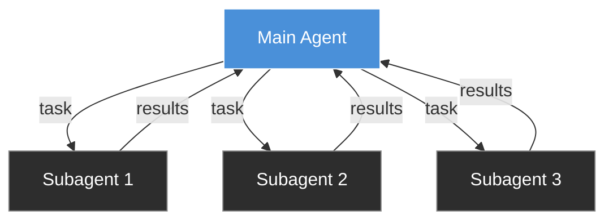
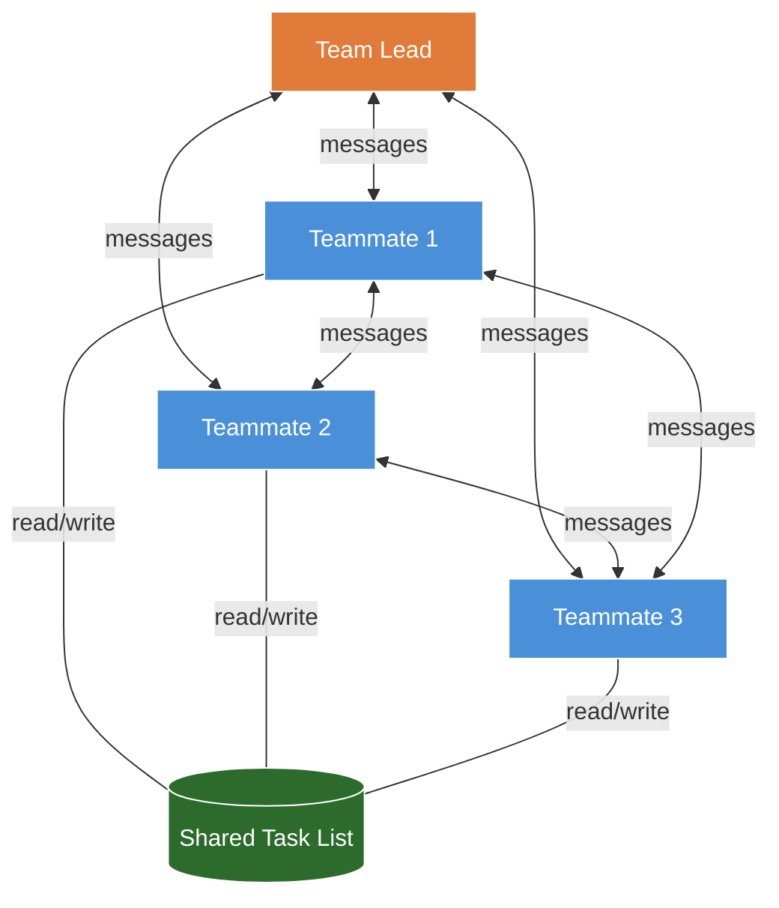
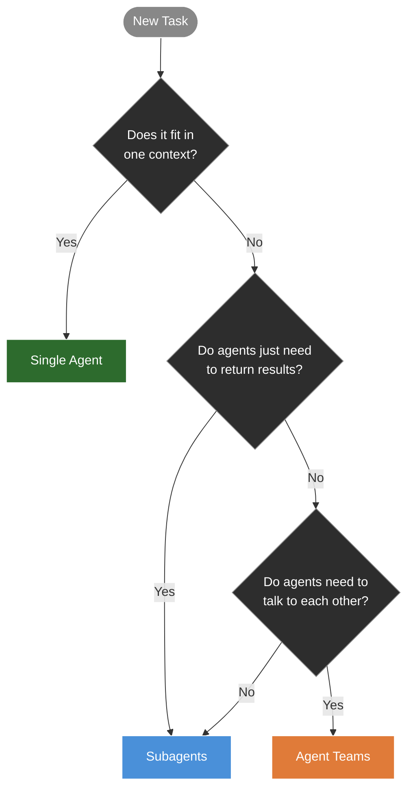
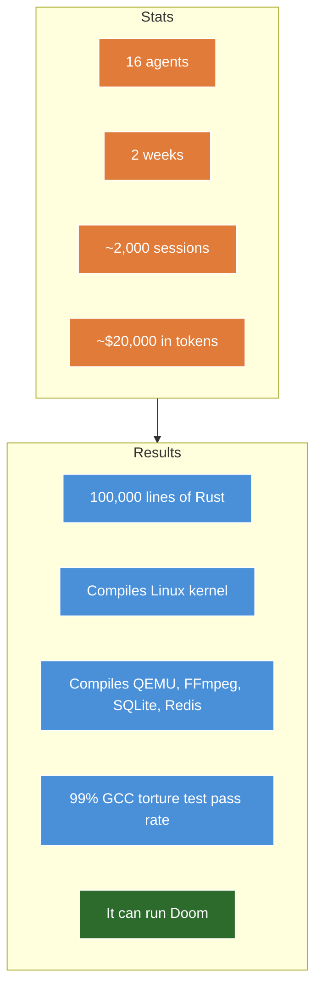
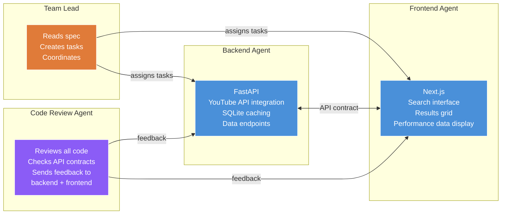
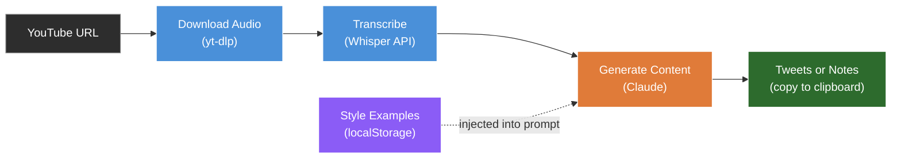

# Claude Code Agent Teams

## What are agent teams?

Agent teams let you run multiple Claude Code instances that work together on the same project. One instance acts as the team lead. It spawns teammates, creates tasks, and coordinates the work. Each teammate is an independent Claude Code session with its own context window.

The teammates can message each other directly. That's the key thing that makes this different.

## Why is this interesting?

A few examples of what you can do:

- One Claude Code instance writes code while another one reviews it. The reviewer sends feedback directly to the writer, who fixes the issues without you relaying anything.
- Three instances work on different parts of your app at the same time. One builds the backend, one builds the frontend, one handles tests.
- Five instances investigate a bug from different angles and argue with each other about the root cause.

The common thread: agents that need to coordinate with each other, not just return results to you.

## How subagents work

If you've used Claude Code, you've probably used subagents. You ask Claude to do something and it spawns a helper to handle part of the work. The helper does the job and reports back.



Subagents can only talk back to the parent. They can't talk to each other. If the frontend agent needs the API response shape from the backend agent, it reports back to you, you relay it. You're the middleman.

## How agent teams work

Agent teams remove the middleman. Teammates message each other directly and share a task list.



The backend agent can tell the frontend agent the response shape directly. The reviewer can send notes straight to the builder. No one is relaying messages.

## Subagents vs agent teams

| | Subagents | Agent teams |
|---|---|---|
| **Context** | Own window, results return to parent | Own window, fully independent |
| **Communication** | Report back to parent only | Message each other directly |
| **Coordination** | Parent manages everything | Shared task list, self-coordination |
| **Best for** | Focused tasks where you just need the result | Work that needs discussion and iteration |
| **Token cost** | Lower | ~3x per teammate |

Use subagents when agents just need to return results. Use agent teams when agents need to talk to each other.

## When to use what



- **Single agent (~80% of work):** The task fits in one context. Fixing a bug, writing a function, refactoring a file.
- **Subagents (~15%):** You need parallel work but agents don't need to coordinate. Research, generating tests, focused tasks where you just want the result.
- **Agent teams (~5%):** The work spans multiple layers and agents benefit from talking to each other. Frontend + backend + tests. Code review with feedback loops.

## How to set it up

Agent teams are experimental. You need to opt in.

### 1. Enable agent teams

Add this to your `.claude/settings.json`:

```json
{
  "env": {
    "CLAUDE_CODE_EXPERIMENTAL_AGENT_TEAMS": "1"
  }
}
```

### 2. Install tmux

tmux is a terminal multiplexer. That's a fancy way of saying it lets you open many terminals at the same time inside one window. If you've done any engineering or ops work, you've probably used it before.

For agent teams, tmux is what lets you watch all your agents working side by side. Each agent gets its own pane. You can see the backend agent writing API routes in one pane while the frontend agent builds components in another. Without tmux, the agents still work but you can only see one at a time.

```bash
# macOS
brew install tmux

# Ubuntu/Debian
sudo apt install tmux

# Check it installed
tmux -V
```

If you've never used tmux before, the only thing you need to know right now is that it manages "sessions" and "panes." Claude Code handles the panes for you. You just need to start a session.

### 3. Set the display mode

Tell Claude Code to use tmux for agent teams. Add this to your `.claude/settings.json`:

```json
{
  "teammateMode": "tmux"
}
```

### 4. Start a session

Start a tmux session, then launch Claude Code inside it:

```bash
tmux new -s demo
claude
```

When you tell Claude to use agent teams, it will automatically split your tmux window into panes — one for each agent. You'll see them all working at the same time.

### Useful shortcuts

- **Shift+Up/Down** — switch between teammates to message them directly
- **Shift+Tab** — delegate mode. Stops the lead from writing code itself. Forces it to only coordinate.
- **Ctrl+T** — toggle the shared task list

## How far this scales

Anthropic's engineering team used agent teams to build a C compiler from scratch in Rust.



## Demo: building an app with three agents

We build a YouTube topic researcher. You search a topic and it shows you all the videos on that subject with performance data. Three agents work on it in parallel.



How it works:

1. Write a spec describing the app — architecture, endpoints, data model, components
2. Tell Claude to "use agent teams to build this"
3. Claude reads the spec, breaks it into tasks, spawns the three agents
4. The backend agent builds the API. The frontend agent builds the UI. They coordinate on the API contract directly.
5. When both are done, the code review agent reads everything, checks for issues, and sends specific feedback to each agent
6. The backend and frontend agents act on that feedback and make fixes

The code review agent doesn't fix things itself. It sends notes like "the /search endpoint returns a flat list but the frontend expects nested objects" directly to the backend agent, who fixes it.

This is the closed-loop feedback that subagents can't do. The reviewer talks to the builders. The builders act on the feedback. No middleman.

## The pattern I find most useful

You don't need three agents building a full-stack app to get value from this. The pattern I keep coming back to is a second-pass reviewer that auto-runs on my changes.

I write code with one agent. When I'm done, a reviewer agent reads what I wrote and sends specific notes back. "This endpoint doesn't handle the empty array case." "The error message here is generic, the user won't know what went wrong." Concrete stuff, not style nits.

The reviewer doesn't fix anything. It sends the notes to the agent that owns the code, and that agent makes the changes. That closed-loop feedback is the thing that makes teams worth using over subagents. You get a second pair of eyes without relaying anything yourself.

Start here before you try a three-agent build. One writer, one reviewer. See how the feedback loop works. Then scale up.

## Things to watch out for

- **Token cost.** Three agents running in parallel costs roughly 3x a single session. Make sure the coordination is adding value.
- **Same file edits.** Two agents editing the same file will overwrite each other. Break the work so each agent owns different files.
- **Reviewer behaviour.** Sometimes the review agent implements fixes itself instead of delegating back. I had a code review agent just go ahead and make the changes. In an ownership model you want it to report the issue and let the owning agent fix it. Watch for this and course-correct if you see it.
- **Still experimental.** No session resumption for teammates. Task status can lag. One team per session.

## The app pipeline


