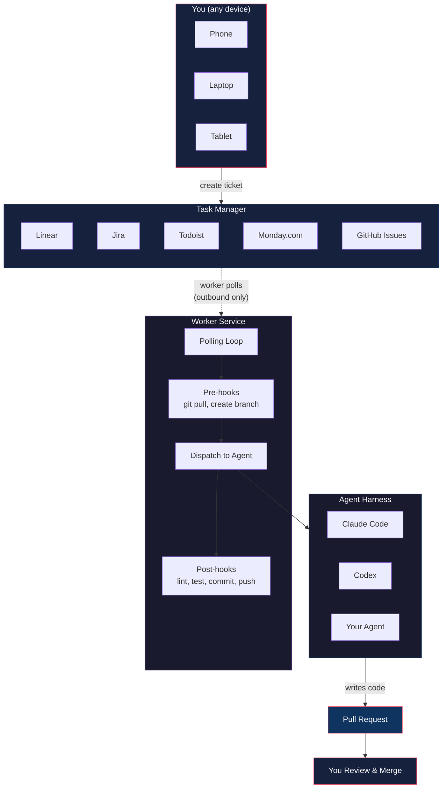
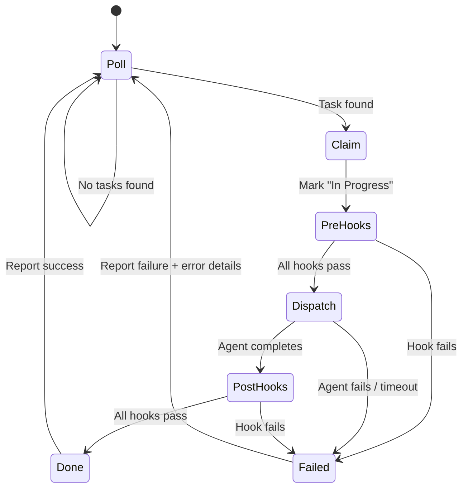
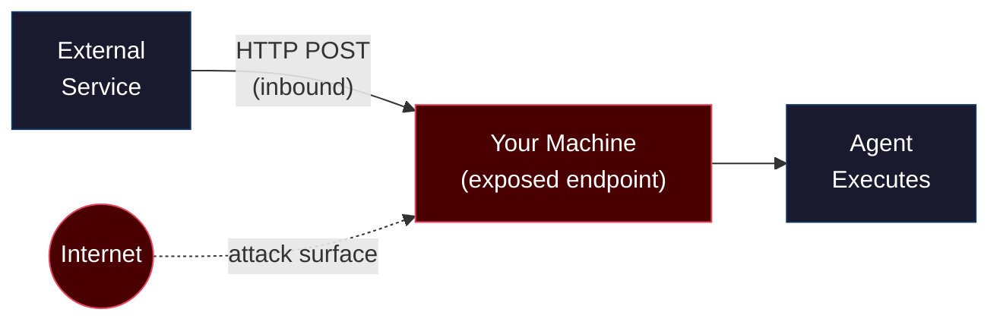
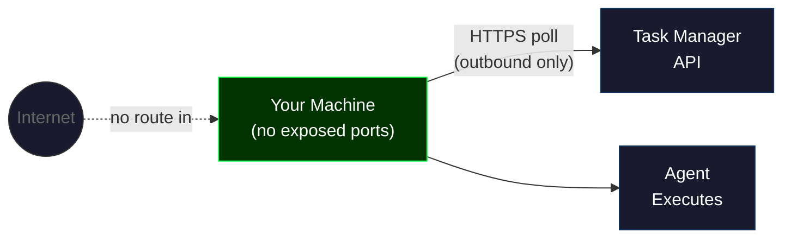
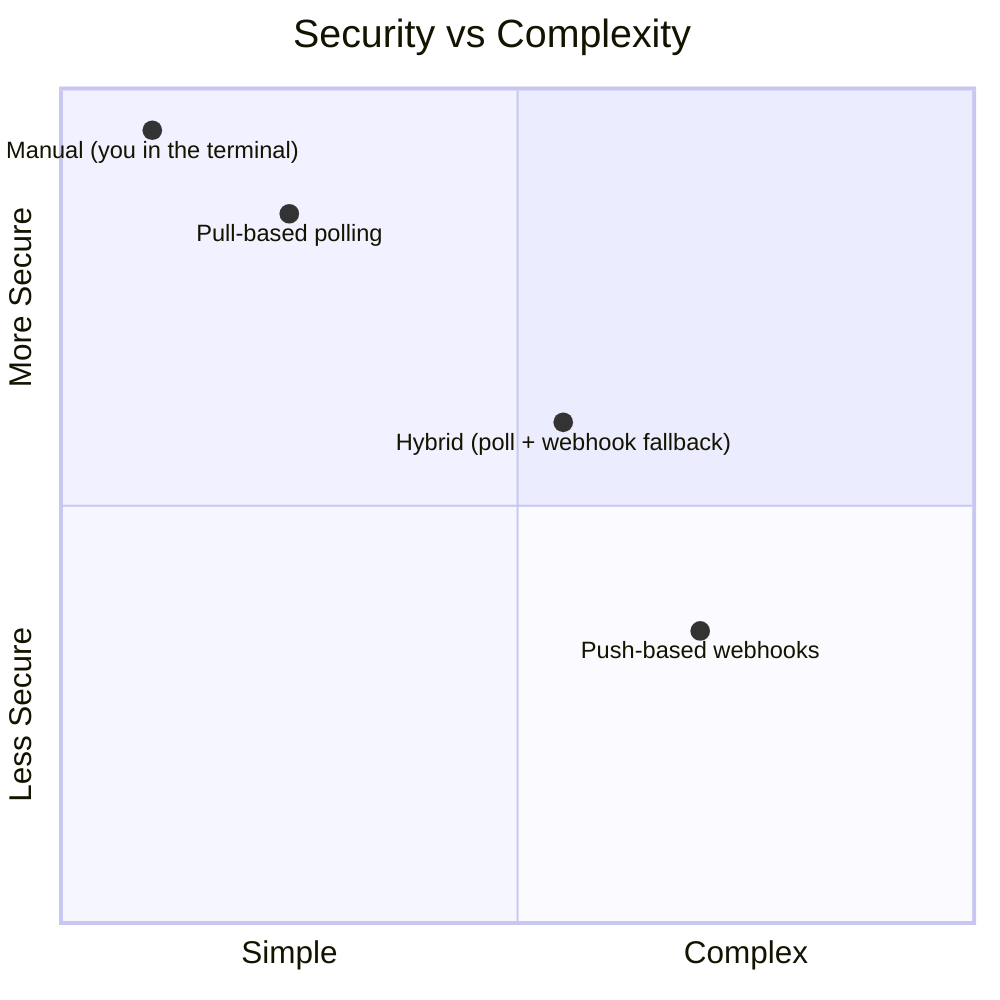
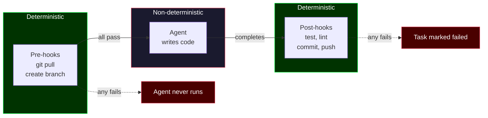
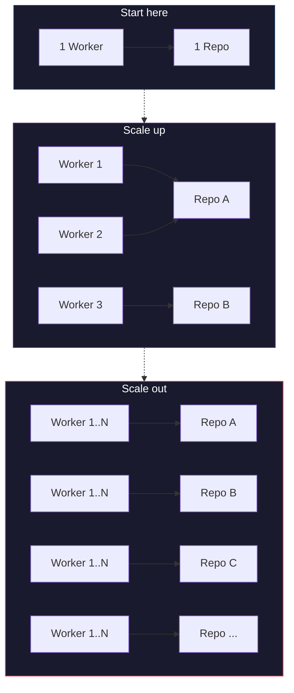

# Background Agent Workers: A Pull-Based Architecture

Companion guide for [My Multi-Agent Team (Built From Scratch)](https://youtube.com/@owainlewis).

---

## The Problem

Most of us use AI coding agents the same way: open a terminal, start a session, paste context, prompt, wait, correct, repeat. It works, but you're the bottleneck. You can only run one task at a time because every task needs you in the loop.

Tools like OpenClaw attempt to solve this by letting agents run in the background. But they're built on a **push-based (webhook) architecture** that exposes HTTP endpoints on machines with access to your code, credentials, and file system. That's a security surface you don't need. And for most use cases, it's massively over-engineered.

There's a simpler approach.

---

## The Solution

**agent-worker** is a polling-based background agent that watches your task manager for work, picks it up, executes an agent harness, and reports results back. You stay out of the loop entirely.


> **Task manager agnostic.** The reference implementation uses Linear, but the pattern works with any task manager that has an API: Todoist, Jira, Monday.com, GitHub Issues, Asana. The worker just needs a way to query for ready tasks and update their status. Swapping task managers is a single adapter file.

> **Agent harness agnostic.** The worker supports any agent that can accept a prompt and return a result. Currently ships with Claude Code and Codex adapters. Adding a new one is a single file implementing the executor interface. You're not locked to any vendor.

The full source code is at [github.com/owainlewis/agent-worker](https://github.com/owainlewis/agent-worker).

---

## Architecture

The system has three components:



1. **Task Manager** is the source of truth. You create tickets here from any device. A label or status marks a ticket as agent-ready. The reference uses Linear, but any task manager with an API works.
2. **Worker Service** runs on your machine and polls the task manager on a schedule. When it finds a ready ticket, it claims it and starts processing.
3. **Agent Harness** does the actual coding work. Claude Code, Codex, or anything that accepts a prompt and returns a result.

### The Worker Loop



1. **Poll** the task manager for tickets marked ready
2. **Claim** the ticket by marking it "In Progress" (no two workers pick up the same ticket)
3. **Pre-hooks** run deterministic setup: git pull, create a branch
4. **Dispatch** the ticket to the agent harness with a structured prompt
5. **Post-hooks** run deterministic verification: lint, test, commit, push
6. **Report** success or failure back to the task manager with details

If anything fails at any step, the ticket is marked failed with the error message as a comment. You can see exactly what went wrong without leaving your task manager.

---

## Pull-Based vs Push-Based Architecture

This is the core architectural decision and it has real security implications.

### Push-based (webhook)

This is how tools like OpenClaw work. An external service sends HTTP requests to your agent when there's work to do.



**What this requires:**
- An HTTP endpoint exposed to the internet (or at minimum, to the service)
- A machine that accepts inbound connections
- Port forwarding, tunneling, or a public IP
- Authentication and authorization on the endpoint

**The problem:** The machine running your agent has access to your code, your file system, your credentials, your git config. Exposing an HTTP endpoint on that machine creates an attack surface. Anyone who can reach that endpoint can potentially trigger agent execution.

### Pull-based (polling)

This is how agent-worker works. Your machine reaches out to the task manager on a schedule. Nothing reaches in.



**What this requires:**
- Outbound HTTPS requests to the task manager API
- An API key
- Nothing else

**Why this is better for agent work:**
- **No exposed ports.** Your machine makes outbound requests only. There's nothing to attack from the outside.
- **No inbound connections.** No tunneling, no port forwarding, no public IP required.
- **Simpler infrastructure.** No webhook receivers, no authentication middleware, no retry logic for failed deliveries.
- **Works anywhere.** Behind a NAT, on a home network, on a corporate VPN. If you can make HTTPS requests, you can run the worker.

### The Tradeoff

Pull-based has higher latency. If you poll every 60 seconds, a new ticket waits up to 60 seconds before pickup. For background coding tasks that take minutes to complete, this is irrelevant. If you needed sub-second response times, push-based would be better. For agent work, you don't.

### Comparison



| | Push-based (webhooks) | Pull-based (polling) |
|---|---|---|
| **Direction** | Service pushes to your machine | Your machine pulls from service |
| **Exposed surface** | HTTP endpoint on agent machine | None |
| **Inbound connections** | Required | None |
| **Infrastructure** | Webhook receiver, auth, retry logic | Polling loop, API key |
| **Latency** | Near-instant | Poll interval (e.g. 60s) |
| **Security posture** | Machine with code access accepts inbound traffic | Outbound requests only |
| **Best for** | Real-time triggers, low-latency | Background tasks, coding agents |

---

## Hooks: Deterministic Guardrails Around Non-Deterministic Agents

Agents are powerful but non-deterministic. You can't predict exactly what code they'll write. Hooks solve this by wrapping agent execution with deterministic, auditable steps.



### Pre-hooks

Run before the agent starts. If any pre-hook fails, the agent never runs.

```yaml
hooks:
  pre:
    - "git checkout main"
    - "git pull origin main"
    - "git checkout -b agent/task-{id}"
```

These guarantee the agent starts from a clean, up-to-date state on a dedicated branch. If `git pull` fails (maybe you're offline, maybe there's a conflict), the agent never touches the codebase.

### Post-hooks

Run after the agent finishes. If any post-hook fails, the task is marked failed.

```yaml
hooks:
  post:
    - "bun run test"
    - "bun run lint"
    - "git add -A"
    - "git commit -m 'feat: {title}'"
    - "git push origin agent/task-{id}"
```

The agent doesn't get to declare itself done. The tests do. If the code doesn't pass lint and tests, it doesn't get committed or pushed. The agent has to meet the same bar any human developer would.

### Why This Matters

Without hooks, you're letting an agent loose on your codebase with no guardrails. With hooks, you have a deterministic process wrapped around a non-deterministic agent. The agent does the creative work. The hooks enforce the process.

---

## Configuration

The worker is configured with a single YAML file. All project-specific logic lives here, not in the worker code. Swap the config, point it at a different repo, and it works.

```yaml
linear:
  project_id: "your-project-uuid"
  poll_interval_seconds: 60

  statuses:
    ready: "Todo"
    in_progress: "In Progress"
    done: "Done"
    failed: "Canceled"

repo:
  path: "/path/to/your/repo"

hooks:
  pre:
    - "git checkout main"
    - "git pull origin main"
    - "git checkout -b agent/task-{id}"
  post:
    - "bun run test"
    - "git add -A"
    - "git commit -m 'feat: {title}'"
    - "git push origin agent/task-{id}"

claude:
  timeout_seconds: 300
  retries: 0

log:
  file: "./agent-worker.log"
```

Hook commands support variable interpolation:

| Variable | Value | Example |
|---|---|---|
| `{id}` | Ticket identifier | `ENG-42` |
| `{title}` | Slugified ticket title | `add-login-page` |
| `{branch}` | Generated branch name | `agent/task-ENG-42` |

---

## Getting Started

### Prerequisites

- [Bun](https://bun.sh) 1.0+
- An agent harness installed and authenticated (Claude Code or Codex)
- A task manager with an API (Linear ships out of the box)

### Setup

```bash
git clone https://github.com/owainlewis/agent-worker
cd agent-worker
bun install
```

Copy and edit the config:

```bash
cp agent-worker.example.yaml agent-worker.yaml
```

Set your API key:

```bash
export LINEAR_API_KEY=lin_api_...
```

### Run

```bash
bun run start
```

The worker starts polling. Create a ticket, add the agent label, and watch it get picked up.

---

## Scaling

The pattern scales without architectural changes:



- **One worker, one repo.** Run `agent-worker` on your laptop. It processes tickets sequentially.
- **Multiple workers, one repo.** Run multiple instances. Each claims tickets atomically (mark as "In Progress"), so no two workers pick up the same task.
- **Multiple workers, multiple repos.** Each worker gets its own config pointing at a different repo. They all poll the same project or different ones.

No additional infrastructure. No orchestration layer. No message broker. Just more workers.

---

## Links

- [agent-worker source code](https://github.com/owainlewis/agent-worker)
- [Video: My Multi-Agent Team (Built From Scratch)](https://youtube.com/@owainlewis)
