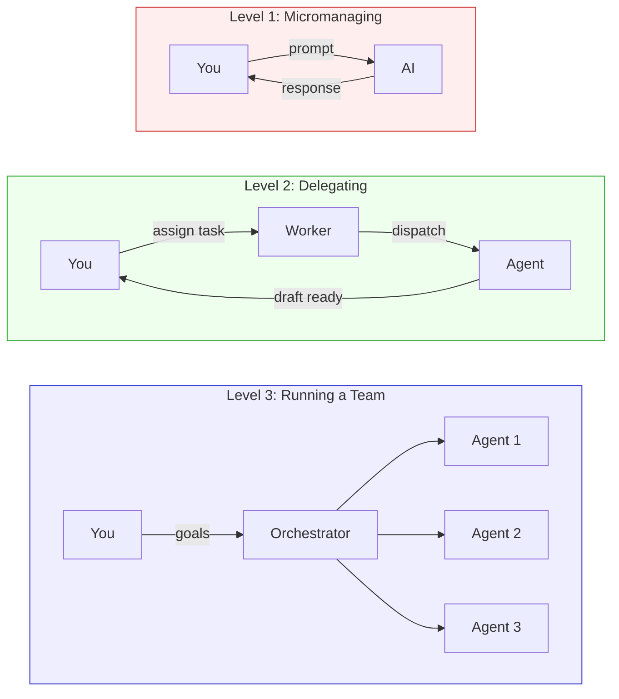
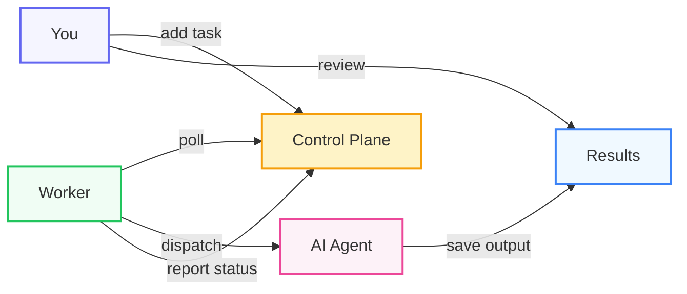
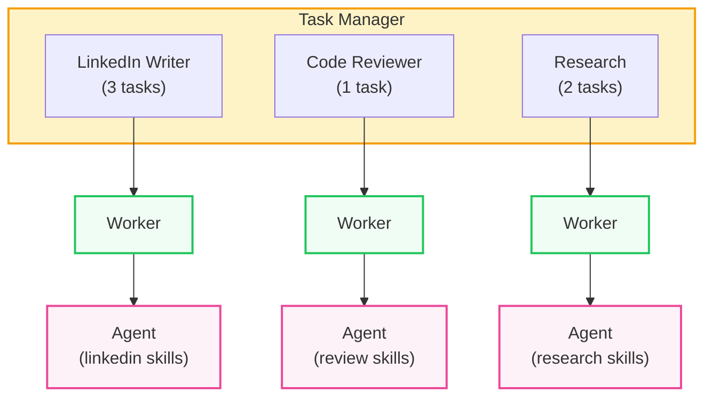

# Background Agents: The Architecture

Every background agent system — OpenClaw, Anthropic's background tasks, Codex — uses the same underlying pattern. This tutorial breaks down the architecture, explains why it works, and shows you how to build your own.

## Three Levels of Working With AI

How you work with AI agents maps directly to how managers work with people.



**Level one is micromanaging.** You sit in a chat window, prompting back and forth, correcting mistakes, staying in the loop the whole time. This is how most people still work with AI. It's useful for exploration, but it's low leverage. No good manager works this way.

**Level two is delegating.** You assign a task, trust the agent to do it, and review the result when it's done. This is where the worker delegation pattern becomes powerful — especially for long-running tasks. If you have a research task that takes ten minutes, you don't want to be sitting in your terminal watching a spinner. You can't close it. You can't context-switch. You're blocked. With delegation, you fire off the task and walk away. The worker picks it up in the background, and the result is waiting when you come back. This is what OpenClaw, Anthropic's background tasks, and Codex are all trying to be. It's a fundamentally different relationship with AI — you're not micromanaging, you're managing.

**Level three is running a team.** Multiple agents coordinating on complex work, breaking down problems, handing off between each other. This sounds exciting but it's mostly hype right now. Level two — treating agents like employees you can delegate to — is where the real value is today.

### The leverage shift

Right now, most people are stuck at level one. They're prompting agents three, four, five times to get a decent result. The agent gets confused, loses context, goes off track — and you're sitting there correcting it the whole time. That's not leverage. That's babysitting.

The move that matters is going from unreliable agents you have to nurse through every step to reliable agents you can hand off a task and trust they'll do it. That's how one person starts doing the work of a team. Not by working more hours. Not by prompting faster. By delegating to agents that actually finish what you started.

This repo is a level two system. The difference from the platforms is that you own the infrastructure and understand the pattern, rather than depending on a specific product.

## Why a Task Manager, Not a Chat Window?

If you're treating agents like employees, you should manage them the same way you manage employees — with a task manager.

Think about how we manage people. We use task managers — Jira, Linear, Monday, Asana, Todoist. We create a ticket, assign it, track the status. Pending, in progress, done. There's an audit trail. There's priority. You can see all outstanding work at a glance.

Now look at how most background agent systems work. OpenClaw uses Telegram. Anthropic uses a chat window. But chat threads are the wrong interface for delegation:

- **No visibility.** You can't see what's pending versus what's done. If you sent three tasks last Tuesday, good luck finding them.
- **No prioritisation.** You can't reorder work, flag something as urgent, or push a task back. Everything is first-in, first-out at best — chaotic at worst.
- **No audit trail.** There's no history of what was assigned, what succeeded, what failed. You're trusting your memory and a scroll bar.
- **No state management.** Chat has no concept of status. A message is either sent or it isn't. There's no "in progress," no "blocked," no "needs review." You're managing state in your head, which doesn't scale.
- **Not sustainable.** It works when you have one agent and three tasks. It falls apart at ten agents and fifty tasks. The interface that works for conversation does not work for delegation.

Task managers solve all of this. Todoist, Monday.com, Jira, Linear, Asana, GitHub Issues — they all give you what delegation requires: visibility, priority, status tracking, audit trails, and access from any device.

This repo uses Todoist, but the pattern is the same with any task manager that has an API. Swap in whatever your team already uses.

## The Three-Component Pattern

When you decompose any level-two agent system, it comes down to three components:



**Control plane** — Where you assign tasks. This is how you tell agents what to do without sitting in a chat window. In this repo, it's a Todoist project. It could be a Jira board, a Linear queue, a Monday.com workspace, or a database table.

**Worker** — A small script that polls the control plane, passes each task to the agent, and reports back with status updates. The worker is a dumb bridge. It doesn't decide what to do. It doesn't build complex prompts. It takes the task text — the exact words you typed — and passes it straight through.

**AI Agent** — The thing that actually does the work. It reads the task, figures out the approach, picks the right tools, and executes. All of the intelligence lives here, not in the worker or the infrastructure.

Everything else — Docker containers, orchestration layers, plugin systems, marketplaces — is implementation detail. The pattern is the same.

## The Pattern Everywhere

The same three components show up in every background agent system. The implementations change — the pattern doesn't.

|  | OpenClaw | Anthropic Background Tasks | This Repo |
|--|----------|---------------------------|-----------|
| **Control plane** | Telegram bot | Web UI | Task manager (Todoist, Jira, etc.) |
| **Task queue** | Internal DB / Redis | Internal infra | Task manager project |
| **Worker** | Docker container | Claude platform | Single Python file |
| **Security** | Framework-level permissions | Platform-level | Subprocess isolation, env vars stripped |
| **Cost of polling** | Agent running continuously | N/A | Plain Python, zero tokens until real work |

Once you see the pattern, you can build your own version with whatever tools you prefer.

## Why This Design?

### Cheap orchestration, expensive execution

The polling loop is plain Python. No AI, no tokens, no cost. The agent only spins up when there's actual work to do. You're not paying for an agent to sit idle — you're paying only when it's doing real work.

### The intelligence lives in the agent

The worker doesn't decide which tool to use. It doesn't route tasks. It doesn't build prompts. It passes the task text straight to the agent, and the agent figures out what to do from its instructions (`CLAUDE.md`) and skill files.

This means you can change what the agent does without touching the worker. Add a new skill file, update the instructions, and the same worker handles completely different types of work.

### Subprocess isolation

Each task runs in a child process with sensitive environment variables stripped. The agent can't access your API keys or internal state. The worker starts each task with `start_new_session=True` for clean process group management — if a task hangs, the watchdog timer kills the entire process group.

No framework-level permission grants. No marketplace. No plugin system. Just OS-level process isolation.

### Human review by default

The agent drafts. You approve. This is non-negotiable.

The agent never publishes, merges, or sends anything directly. There's always a gap between "the agent did work" and "that work reaches the real world." You sit in that gap. Completed tasks stay open in your task manager with an `agent-done` label — you review the output and close the task yourself.

## The Mental Model: Projects as Employees

Think of each project in your task manager as an employee with a specific job.



Each project has its own worker, its own skills, its own permissions. You add a task to the right project and the right agent picks it up — the same way you'd assign a ticket to the right person on your team.

```bash
uv run agent_worker.py --project "LinkedIn Writer" --watch
uv run agent_worker.py --project "Code Reviewer" --watch
uv run agent_worker.py --project "Research" --watch
```

Adding a task is like putting a brief on someone's desk.

## Adapting the Pattern

The architecture is designed to be swapped piece by piece. Replace the control plane, the agent, or the output target — the pattern stays the same.

### Different control planes

Any task manager with an API works:

| Control Plane | How to poll | How to mark done |
|---------------|-------------|-----------------|
| Todoist | `todoist-api-python` SDK | Add label + comment |
| Linear | GraphQL API | Move to "Review" status |
| Monday.com | REST API | Update status column |
| Jira | REST API | Transition to "In Review" |
| GitHub Issues | `gh` CLI or REST API | Add label + comment |
| Asana | REST API | Move to review section |
| Airtable | Filter by status field | Update status to "review" |
| PostgreSQL | `SELECT WHERE status = 'pending'` | `UPDATE SET status = 'review'` |

Replace the `TodoistQueue` class in the worker and the rest stays the same.

### Different agents

The dispatch function just runs a subprocess. Swap in any agent that accepts a prompt via CLI:

```python
subprocess.run(["claude", "-p", prompt, ...])
```

The pattern works the same — the intelligence lives in the agent, not the infrastructure.

### Different outputs

Change the skill files and the output changes. Write to a database, create a PR, post to Slack, push to Airtable. The worker doesn't care — it just dispatches and reports back.

## Trust and Verification

Autonomous agents aren't fully reliable yet, especially on complex work. The system is designed around that reality.

**Start with low-stakes tasks.** Content drafts, research summaries, code review flags. Tasks where bad output costs you five minutes of review, not a production incident. Expand the scope as you build confidence.

**Watch for silent failures.** An agent can fail in two ways. The obvious way — it crashes. Easy to catch. The dangerous way — it succeeds, but the output is wrong. A factual error in a post, a subtle bug in code. It looks fine. You almost approve it. Design your review process around the second kind.

**Set budget ceilings.** Track token usage per task. Set a daily spend limit. You don't want to discover a runaway agent by looking at your API bill.

The honest truth: the value isn't perfect output. It's that the work is waiting for you instead of starting from scratch. A task that's ninety percent done is still incredibly valuable — you're reviewing and finishing instead of creating from zero.
