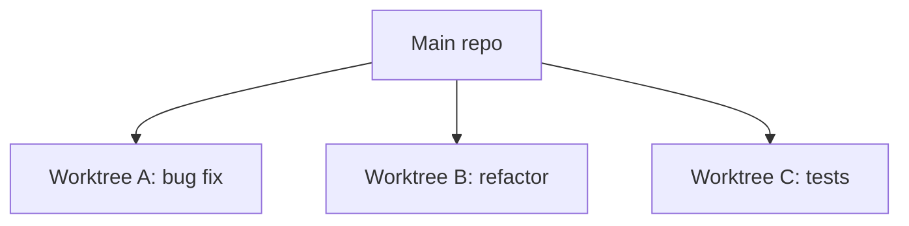

# OpenAI Codex For Developers

Companion repo for the YouTube guide.

This file is the short version. It is meant to be read while you watch.

If you only read one thing, read this:

1. Write a better task brief.
2. Use `workspace-write` + `on-request`.
3. Review every diff like a PR.
4. Use Worktrees for isolated parallel work.

---

## Start Here

### 1. Install Codex

```bash
npm install -g @openai/codex
# or
brew install codex

codex --version
```

### 2. Create `AGENTS.md` in a real repo

Open Codex in your project:

```bash
codex
```

Then run:

```text
/init
```

Use [`01-setup/AGENTS.md`](01-setup/AGENTS.md) as a simple example.

### 3. Set safe default permissions

Copy [`config.toml.example`](config.toml.example) to `~/.codex/config.toml`.

Recommended default:

```toml
sandbox_mode = "workspace-write"
approval_policy = "on-request"
```

### 4. Use the task brief template

Start with [`02-task-briefs/template.md`](02-task-briefs/template.md).

---

## The Whole Workflow


That is the product.

Codex is not autocomplete. It is delegation.

---

## Pick The Right Surface

| Need | Use |
|---|---|
| Small supervised work in your current checkout | Local |
| Isolated parallel work | Worktree |
| Terminal workflow or automation | CLI |
| Quick editor convenience | VS Code extension |

### Local

Use Local when you want to stay close to the change.

Examples:
- explain this file
- add one focused test
- make one small fix

### Worktree

Use Worktree when you want isolation.

Examples:
- run 2-3 tasks in parallel
- try a refactor without touching your current checkout
- let Codex work in the background while you do something else

### CLI

Use the CLI when you want Codex in your shell or your tooling.

Examples:
- `codex exec "review this diff"`
- `codex review --base main`
- add Codex targets to your `justfile`

---

## Write Better Tasks

This is the biggest quality lever.

Bad:

```text
Improve the API.
```

Better:

```text
Goal: Add a /health endpoint that returns {"status":"ok"}.
Context: Follow the router pattern in src/api/routers/users.py.
Acceptance criteria:
- GET /health returns 200
- Test exists at tests/api/test_health.py
Tests: pytest tests/api/test_health.py -x
Constraints: No new dependencies. Do not refactor other routers.
Non-goals: No auth. No DB check.
```

Use these files:

- [`02-task-briefs/template.md`](02-task-briefs/template.md)
- [`02-task-briefs/good-example.md`](02-task-briefs/good-example.md)
- [`02-task-briefs/bad-example.md`](02-task-briefs/bad-example.md)

Rule of thumb:

> Vague in, vague out.

---

## Permissions In Plain Language

Codex checks three things:

1. Is this inside the workspace?
2. Does this need the internet?
3. Should I ask first?

That maps to three controls:

- `sandbox_mode`
- `network_access`
- `approval_policy`

### Safe default

| Setting | Default to use |
|---|---|
| Sandbox | `workspace-write` |
| Approval | `on-request` |
| Network | On only if you need installs or API calls |

### Sandbox modes

| Mode | Use it when |
|---|---|
| `read-only` | Review, explain, analyze |
| `workspace-write` | Normal day-to-day coding |
| `danger-full-access` | Only in a trusted disposable environment |

### One sentence to remember

> Sandbox is the boundary. Network is internet access. Approval is whether Codex asks first.

### If Codex needs another directory

Do this:

```bash
codex --add-dir /path/to/other/folder
```

Not this:

```bash
codex --dangerously-bypass-approvals-and-sandbox
```

Read the full guide:

- [`codex-permissions-guide.md`](codex-permissions-guide.md)

---

## Review The Diff Properly

Do not ask:

> "Did it run?"

Ask:

1. Did it do what the brief asked?
2. Did it stay in scope?
3. Did it add or run the right tests?
4. Does it follow the repo's existing patterns?

Use:

- [`03-review/code_review.md`](03-review/code_review.md)
- `/diff`
- `/review`

---

## Setup That Actually Matters

### `AGENTS.md`

This is the standing context for the repo.

Put these inline:

- test commands
- lint and typecheck commands
- package manager
- repo layout
- coding conventions
- review expectations

You can also point Codex at longer docs when useful, but the must-follow rules should live inside `AGENTS.md`.

Use:

- [`01-setup/AGENTS.md`](01-setup/AGENTS.md)

### `config.toml`

Your config file is for defaults, not for cleverness.

Keep it simple:

```toml
sandbox_mode = "workspace-write"
approval_policy = "on-request"
```

Use:

- [`config.toml.example`](config.toml.example)

---

## CLI Shortcuts Worth Knowing

### Resume the last session

```bash
codex resume --last
```

### Resume with a picker

```bash
codex resume
```

### Run Codex without the TUI

```bash
codex exec "add input validation to src/api/users.py"
```

### Pipe something in

```bash
cat error.log | codex exec "Explain this error and suggest a fix"
```

### Compact a long session

```text
/compact
```

### Fork before risky work

```text
/fork
```

### Plan before code

```text
/plan
```

### Review from the CLI

```bash
codex review --base main
```

---

## Worktrees Matter

Worktrees are the reason the desktop app is interesting.

Without worktrees:

- one checkout
- one branch
- one active task

With worktrees:

- separate directories
- separate working state
- multiple tasks at once

Quick mental model:



Worktrees are file isolation.

They are not sandboxing.

---

## Skills, Plugins, Automation

You do not need these on day one.

They become useful once the basics are working.

### Skills

Reusable workflows in `SKILL.md`.

Useful demo shortcut:

```text
$
```

Type `$` in Codex to view your available skills, then pick one or describe a task that matches it.

Use:

- [`04-skills/example-skill/SKILL.md`](04-skills/example-skill/SKILL.md)

### Plugins

Best example: Linear.

Use:

- [`05-plugins/README.md`](05-plugins/README.md)

### Automation

Best entry point: `codex exec` in your `justfile`.

Use:

- [`06-automation/justfile`](06-automation/justfile)

---

## Codex Vs Claude Code

Use both.

| Codex | Claude Code |
|---|---|
| Delegation | Conversation |
| Parallel tasks | Interactive debugging |
| Ticket-shaped work | Exploratory work |
| Reviewable diffs | Back-and-forth reasoning |

Simple rule:

If you can write a clear brief, reach for Codex.

If you are still figuring the problem out, reach for Claude Code.

---

## Resources

Downloadable resources live here:

- [`resources/README.md`](resources/README.md)

Most useful files:

- [`config.toml.example`](config.toml.example)
- [`codex-permissions-guide.md`](codex-permissions-guide.md)
- [`02-task-briefs/template.md`](02-task-briefs/template.md)
- [`resources/plan-template.md`](resources/plan-template.md)
- [`01-setup/AGENTS.md`](01-setup/AGENTS.md)
- [`03-review/code_review.md`](03-review/code_review.md)
- [`06-automation/justfile`](06-automation/justfile)
