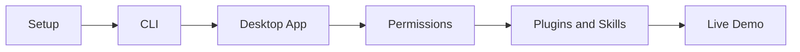
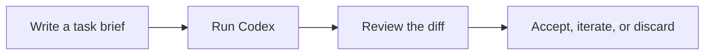
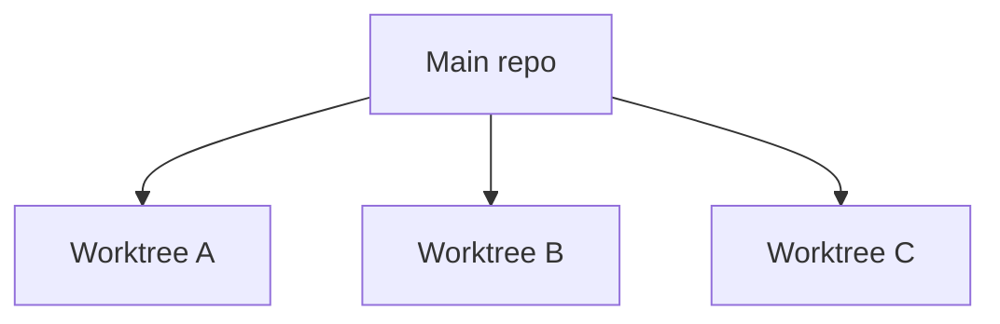

# OpenAI Codex For Developers

Companion repo for the YouTube guide.

This README is written in the same order you would usually teach the video.



---

## 1. Setup

### Install Codex

```bash
npm install -g @openai/codex
# or
brew install codex

codex --version
```

### Create `AGENTS.md`

Open Codex in a real project:

```bash
codex
```

Then run:

```text
/init
```

`AGENTS.md` is the standing context for the repo.

This is where you put the rules Codex should follow every time:

- how to run tests
- repo layout
- ticket workflow
- commit conventions
- any project-specific rules that should stay stable

Good way to explain it on camera:

> `AGENTS.md` is the file that tells Codex how this repo works.

Use [`01-setup/AGENTS.md`](01-setup/AGENTS.md) as a real example.

### Set safe defaults

Copy [`config.toml.example`](config.toml.example) to `~/.codex/config.toml`.

Recommended default:

```toml
sandbox_mode = "workspace-write"
approval_policy = "on-request"
```

That is enough for most developers.

### What belongs in `AGENTS.md`

Keep it short and practical.

Good sections:

- what the product does
- where code lives
- commands to run
- ticket workflow
- git workflow
- links to longer product docs when they matter

---

## 2. CLI

The CLI is the easiest place to start because you can see exactly what Codex is doing.

### Start Codex

```bash
codex
```

### Useful commands to demo

Resume the last session:

```bash
codex resume --last
```

Resume with a picker:

```bash
codex resume
```

Run Codex without the TUI:

```bash
codex exec "add input validation to src/api/users.py"
```

Pipe something in:

```bash
cat error.log | codex exec "Explain this error and suggest a fix"
```

Review from the CLI:

```bash
codex review --base main
```

Useful slash commands:

```text
/init
/diff
/review
/plan
/fork
/compact
```

### Core idea

Codex is not autocomplete.

It is delegation:



---

## 3. Desktop App

Once the CLI makes sense, the desktop app makes more sense too.

### The two modes that matter

| Mode | Use it for |
|---|---|
| Local | Small supervised work in your current checkout |
| Worktree | Isolated parallel work |

### Local

Use Local when you want to stay close to the change.

Examples:
- explain a file
- add one test
- make one small fix

### Worktree

Use Worktree when you want isolation.

Examples:
- run 2-3 tasks in parallel
- try a refactor without touching your main checkout
- let Codex work in the background

Worktrees are the big idea behind the app:



Worktrees are file isolation.

They are not sandboxing.

### What to show in the app UI

- model picker
- reasoning level
- task input
- diff view
- integrated terminal
- open in VS Code
- line comments on diffs
- automations

### Keyboard shortcuts worth showing

| Shortcut | What it does |
|---|---|
| `Cmd + Enter` | Submit task |
| `Cmd + K` | Open command palette |
| `Cmd + /` | Toggle sidebar |
| `Escape` | Stop current task |

### Simple model guidance

- Start with the default recommended model in Codex
- Use Medium or High reasoning for most work
- Increase reasoning only when the task is genuinely complex

Keep this part simple in the video. The workflow matters more than micro-optimizing model settings.

### Automations

You do not need to go deep on this.

Just mention that the desktop app can run recurring automation-style tasks.

Simple example to show:

- a standup summary
- a recurring check-in on a project
- a scheduled reminder to review a branch or task

Good one-liner for the video:

> Automations are useful when you want Codex to do a repeated job without you having to remember it.

---

## 4. Permissions And Sandboxing

This is the part that sounds complicated but is actually simple once you explain the mental model.

Codex checks three things:

1. Is this inside the workspace?
2. Does this need the internet?
3. Should I ask first?

That maps to:

- `sandbox_mode`
- `network_access`
- `approval_policy`

### Safe default

| Setting | Use this |
|---|---|
| Sandbox | `workspace-write` |
| Approval | `on-request` |
| Network | Only on when you need installs or API calls |

### Sandbox modes

| Mode | Use it when |
|---|---|
| `read-only` | Review, explain, analyze |
| `workspace-write` | Normal coding |
| `danger-full-access` | Only in a trusted disposable environment |

### One sentence to say on camera

> Sandbox is the boundary. Network is internet access. Approval is whether Codex asks first.

### If Codex needs another directory

Do this:

```bash
codex --add-dir /path/to/other/folder
```

Not this:

```bash
codex --dangerously-bypass-approvals-and-sandbox
```

Use the fuller reference here:

- [`codex-permissions-guide.md`](codex-permissions-guide.md)

---

## 5. Plugins

Plugins are easiest to explain after permissions because now the viewer understands that Codex can work with tools too.

Best example: Linear.

Use:

- [`05-plugins/README.md`](05-plugins/README.md)

Simple flow to demo:

1. Install the Linear plugin in the app
2. Ask Codex to show a ticket
3. Use that ticket as the basis for a task
4. Mark the ticket done when the work is finished

---

## 6. Skills

Skills are reusable workflows in `SKILL.md`.

Useful demo shortcut:

```text
$
```

Type `$` in Codex to view your available skills.

Then either pick one or describe a task that matches it.

Use:

- [`04-skills/example-skill/SKILL.md`](04-skills/example-skill/SKILL.md)

Good way to explain it:

> A skill is just a reusable playbook for a kind of task you do often.

---

## 7. Live Demo

Now that the tooling is explained, this is where you show the actual workflow.

### The workflow to show

1. Start from the product context
2. Pull the ticket from Linear
3. Create a branch from the ticket ID
4. Restate the goal in plain English
5. Write a short plan if needed
6. Implement the change
7. Run tests
8. Run a review pass
9. Commit with the ticket ID
10. Push or open a PR if needed

Good way to explain it on camera:

> Linear is the source of truth for the work. The branch is the scope. The plan is the intent. Tests and review are the quality gate.

### Step 1: start from product context

In this workflow there are three layers of context:

- the product spec tells Codex what the product is
- the Linear ticket tells Codex what this task is
- `AGENTS.md` tells Codex how the repo works

That is enough context for a strong implementation pass without dumping the whole project into the prompt.

### Step 2: pull the ticket from Linear

This is where the work starts.

The ticket is the execution scope.

The best ticket shape for AI-assisted implementation is:

- Goal
- Context
- Proposed shape or scope
- Acceptance criteria
- Constraints
- Out of scope

Small but useful addition:

```text
Constraints
- Keep this minimal.
- Preserve the existing CLI workflow.
- Do not add UI or API work outside this ticket.
- Prefer boring local patterns over abstractions.
```

### Step 3: create a branch

The branch keeps the task isolated.

Good rule:

> One ticket, one branch.

### Step 4: restate the goal

Before writing code, say the task back in simple English.

This makes sure the human, the ticket, and the agent are aligned.

### Step 5: make a short plan

Do not turn a small engineering task into a big spec document.

If the ticket is already descriptive, the plan can stay very short.

Example:

```md
# GRA-141 Plan

Goal: persist scraped jobs into Postgres while keeping CSV export.

Steps:
1. Add DB configuration and connection setup.
2. Define minimal `jobs` table.
3. Implement job upsert logic.
4. Wire scraper CLI to persist jobs.
5. Keep CSV export optional.
6. Add tests for upsert and rerun behavior.
7. Run review and cleanup.
```

Use:

- [`resources/live-demo-workflow.md`](resources/live-demo-workflow.md)
- [`resources/plan-template.md`](resources/plan-template.md)

### Step 6: implement in small reviewable steps

The goal is not "let the agent cook forever."

The goal is a clean diff that is easy to review.

### Step 7: write a better task brief

Bad:

```text
Improve the API.
```

Better:

```text
Goal: Add a /health endpoint that returns {"status":"ok"}.
Context: Follow the router pattern in src/api/routers/users.py.
Acceptance criteria:
- GET /health returns 200
- Test exists at tests/api/test_health.py
Tests: pytest tests/api/test_health.py -x
Constraints: No new dependencies. Do not refactor other routers.
Non-goals: No auth. No DB check.
```

Use:

- [`02-task-briefs/template.md`](02-task-briefs/template.md)
- [`02-task-briefs/good-example.md`](02-task-briefs/good-example.md)
- [`02-task-briefs/bad-example.md`](02-task-briefs/bad-example.md)

Rule of thumb:

> Vague in, vague out.

### Step 8: run tests

Do not skip verification in the demo.

Say this clearly:

> The agent is not done when it writes code. It is done when the change passes verification.

### Step 9: review the diff properly

Do not ask:

> Did it run?

Ask:

1. Did it do what the brief asked?
2. Did it stay in scope?
3. Did it add or run the right tests?
4. Does it follow the repo's patterns?

Use:

- [`03-review/code_review.md`](03-review/code_review.md)
- `/diff`
- `/review`

### Step 10: commit like a professional

If the work maps to a Linear ticket, include the ticket ID in the commit message.

Good example:

```text
GRA-141 Add minimal Postgres persistence
```

That keeps the ticket, branch, commit history, and implementation aligned.

### Reusable resources for this demo

Good files to mention at the end of the demo:

- [`01-setup/AGENTS.md`](01-setup/AGENTS.md)
- [`config.toml.example`](config.toml.example)
- [`codex-permissions-guide.md`](codex-permissions-guide.md)
- [`resources/live-demo-workflow.md`](resources/live-demo-workflow.md)
- [`resources/plan-template.md`](resources/plan-template.md)
- [`06-automation/justfile`](06-automation/justfile)

---

## 8. Codex Vs Claude Code

Use both.

| Codex | Claude Code |
|---|---|
| Delegation | Conversation |
| Parallel tasks | Interactive debugging |
| Ticket-shaped work | Exploratory work |
| Reviewable diffs | Back-and-forth reasoning |

Simple rule:

If you can write a clear brief, reach for Codex.

If you are still figuring the problem out, reach for Claude Code.

---

## Resources

Downloadable resources live here:

- [`resources/README.md`](resources/README.md)
