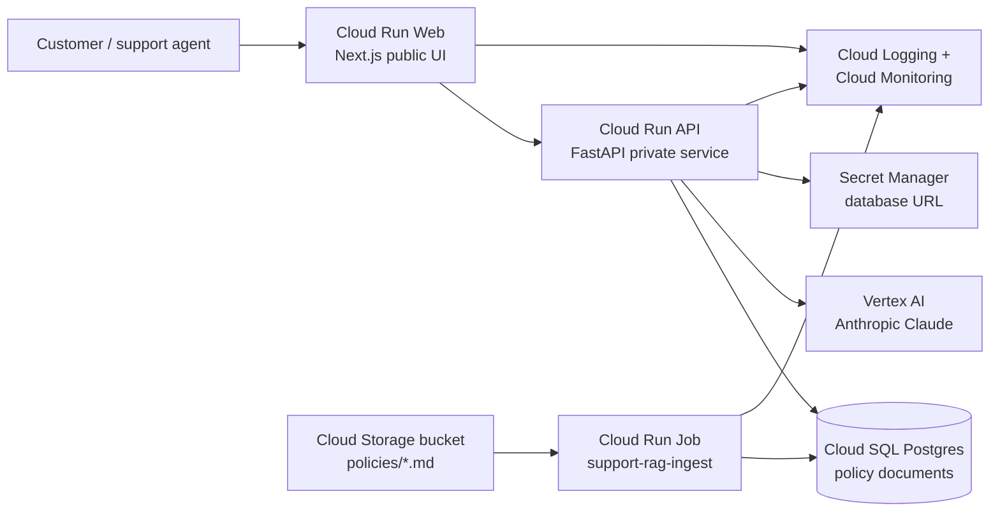
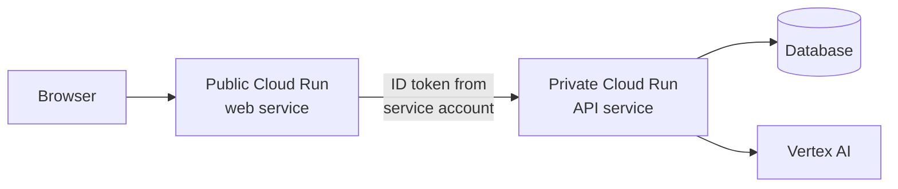

# Deploy AI Systems on Google Cloud With OpenAI Codex

> Companion repository for the YouTube video [How I Deploy Real AI Systems With OpenAI Codex](#).

This is the engineering reference behind the video. It covers the architecture I use for production AI work on Google Cloud, the patterns I default to, and why AI coding agents have changed what's possible for solo developers shipping to the cloud.

The video walks through deploying a customer-support RAG application live, end to end, with Codex as the deployment partner. The demo app source lives in a separate repo, linked in the description.

---

## Why This Exists

When I started my freelance business, this was the problem that almost broke me.

I could build AI applications. That part was easy. AI coding tools made building software faster than ever. What I couldn't figure out was how to deploy them properly. How to put them in front of real customers, behind a real URL, on infrastructure that wouldn't fall over. How to manage multiple client projects, billing, costs, scaling, and production inference. All as a solo developer. It felt overwhelming.

I tried every option I could find:

- **Self-managed VPS.** Renting a Linux box for ten dollars a month and doing everything myself. Configuring nginx, fighting SSL, writing my own backups, setting up monitoring I'd skip half the time. I became a part-time DevOps operator instead of a developer.
- **Managed PaaS.** Vercel, Render, Railway. Fantastic for small projects. The moment a client wanted a real database, scheduled jobs, or production-grade AI inference, the platforms hit a ceiling. As soon as my projects got real, I outgrew them.
- **Cloud providers.** Google Cloud, AWS, Azure. The right answer technically. Compute that scales, managed databases, secrets, observability, model inference. The same stack from a tiny automation to a system serving thousands of customers. But the cost was real. Permissions are a nightmare, documentation is dense, pricing is opaque, enterprise terminology everywhere. It can genuinely feel like you need a PhD to operate these platforms. And I say that as someone who's been doing it for 20 years.

That tension (cloud is the right answer, cloud is genuinely hard) is exactly the gap AI coding agents close.

The kind of work in this tutorial (provisioning a GCP project from scratch, wiring minimum-scope IAM, deploying a containerised service, setting up structured logging, building a monitoring dashboard, shipping alerting, and bolting on continuous deployment) used to take a team of engineers two to three weeks to do correctly. With Codex as a deployment partner, I do it in an afternoon.

Not because the work got easier. The cloud didn't get simpler. The shift is that the boring parts are now generated, the cryptic errors are now explained, and the operational discipline is now defaulted into.

The kind of work that used to require a DevOps team is now a single developer with a clear spec and a good agent. That's the unlock. This repo is how to actually do that work.

### What agents handle in this workflow

Six things Codex does well in cloud deployment that would otherwise take hours:

1. **IAM debugging.** When you see a `permission denied` error, you hand it to Codex. It reads the missing role from the error and tells you exactly which IAM binding to add. Used to take me 20 minutes per error.

2. **Minimum-scope IAM.** Most tutorials grant `roles/owner` and pray. Codex reads the actual API requirements and gives you only what's needed. The result is a system you can put a client's name on.

3. **Terraform from intent.** Describe what you want. Codex drafts the Terraform. You review. About five minutes versus an hour from scratch.

4. **Monitoring in one prompt.** "Create a log-based metric counting errors in this service, and an alerting policy that fires when the metric exceeds zero." Codex writes the Terraform for both. Setting up monitoring used to be the most annoying part of any deploy.

5. **Cost analysis.** Ask "what will this run me at low traffic" and Codex turns the GCP pricing pages into a real number. It explains the difference between `db-f1-micro` and `db-g1-small` and recommends a fit for your workload.

6. **Cost-aware architecture decisions.** When you ask "should I use Cloud SQL or Firestore for this?" it actually reasons about workload. That's architectural thinking, not just code generation.

The complexity hasn't gone away. It's no longer your problem to type out by hand.

---

## The System: Architecture

The video deploys a customer support RAG app. Three runtime services, one database, one bucket, one model. End-to-end, this is what gets shipped:

The browser only ever talks to the public Next.js web service. The web service calls the private API from server-side route handlers, using Google identity-token auth so the API never has to be exposed publicly. The ingest job is a separate runtime that syncs markdown policy documents from Cloud Storage into Postgres. All three runtimes share the same Cloud Logging and Cloud Monitoring stack, with no extra setup.

For the deeper architecture story (request flow, background job flow, permission model, how to brief a coding agent), see [`architecture.md`](architecture.md).

---

## Architecture Patterns for AI Apps on GCP

Most production AI applications on GCP use the same six building blocks. Once you've deployed one, you can deploy any of them. Each pattern below is the default I reach for, with the reason and the failure mode.

### Pattern 1: Cloud Run for stateless services

Web apps, APIs, webhook receivers, internal admin tools. Anything that responds to HTTP. Cloud Run gives you HTTPS, autoscaling, scale-to-zero, revisions, IAM-bound service accounts, and zero server management. For most production AI apps, this is the default container runtime.

The failure mode is reaching for GKE because it sounds more "real." For 90% of AI apps, GKE is solving problems you don't have.

### Pattern 2: Cloud Run Jobs for finite work

Document ingest, batch enrichment, scheduled cleanup, embeddings backfill, scraping, report generation. Anything that starts, runs, exits. Same image as your service. Same service account model. Triggered manually, by Cloud Scheduler on a cron, or by a small webhook receiver.

The failure mode is reaching for Cloud Functions for things that should be Cloud Run Jobs. Codex makes this mistake too. Push back when it does.

### Pattern 3: Public web, private API

Don't expose your backend to the internet if you don't have to. The web service runs public on Cloud Run. The API runs private on Cloud Run. The web service uses its runtime service account to mint a Google ID token and call the private API.

This costs nothing extra, blocks the entire class of "scrape the API directly" attacks, and gives you a clean blast-radius story when something goes wrong.

### Pattern 4: Vertex AI over direct model APIs

For production AI inference on GCP, use Vertex AI rather than calling Anthropic or OpenAI APIs directly.

The strongest argument is the SLA. As a standard direct API customer, you get no contractual uptime commitment. Vertex AI carries a published SLA tied to your GCP agreement. Claude on Vertex sits under that same SLA.

The operational arguments are bigger in practice:

- **Auth via IAM, not API keys.** Your service account calls the model. No long-lived secret to rotate, no key file in your image.
- **Unified billing.** Inference cost shows up on your GCP invoice, not a third-party one.
- **Observability.** Vertex calls show up in Cloud Logging and Cloud Monitoring like any other GCP service. One pane of glass.
- **Multi-model under one auth surface.** Gemini, Claude on Vertex, Llama, all interchangeable. Swap a model name when something better ships.

When direct APIs make sense:

- You need day-zero access to a brand-new model. Vertex usually trails the direct APIs by days to weeks.
- You're not on GCP. The same argument transfers to Bedrock or Azure OpenAI.

For production GCP work with paying customers, Vertex is the default.

### Pattern 5: Cloud SQL for relational data

A managed Postgres instance. The data your app actually needs to query: documents, conversations, audit trails, operational state. Cloud SQL is the only fixed monthly cost in this stack at low traffic, so the database size matters more than the service sizing.

For a low-traffic app: `db-f1-micro` at about $7-8/month is fine. For a real production support system: dedicated-core, because shared-core instances aren't covered by the Cloud SQL SLA.

Backups are not optional. Daily automated backups, 7-day retention minimum, point-in-time recovery turned on. The discipline test isn't enabling backups. It's running a restore drill before calling the system production-ready.

### Pattern 6: Cloud Storage for blob data

Markdown documents, PDFs, audio files, images, model artifacts. Anything that doesn't need a query layer. Storage is essentially free at small scale and integrates cleanly with Cloud Run and Cloud Run Jobs through the same service-account auth model.

For RAG systems specifically: keep the source of truth as files in a bucket and the indexed copy in your database. The bucket is the audit trail. The database is the runtime.

### The Five (six) Services You Actually Need

That's the entire stack for almost every production AI app:

1. **Cloud Run** (or Cloud Run Jobs): runs your code
2. **Cloud SQL** (or Firestore for key-value): stores your data
3. **Secret Manager**: stores your secrets
4. **Vertex AI**: runs your model calls
5. **Cloud Storage**: stores your documents and artifacts
6. **Cloud Logging and Cloud Monitoring**: tells you what's happening (free, automatic)

The other services in GCP don't exist for you until you have a specific reason to add one. Pub/Sub, BigQuery, VPC Service Controls, GKE, App Engine, Dataflow. Ignore them. They're solving problems you don't have yet.

---

## The Agent's Job vs Your Job

The most important thing to be honest about. AI agents are extraordinary at the mechanical parts of cloud work. They are not extraordinary at the parts that require judgment.

### What Codex handles well

- Writing Dockerfiles
- Generating `gcloud` commands and Terraform from intent
- Choosing resource names that follow your conventions
- Creating service accounts and IAM bindings
- Wiring Cloud Run to Cloud SQL via Unix sockets
- Resolving Secret Manager references
- Reading and explaining permission errors
- Drafting smoke tests and runbooks
- Producing the first version of a monitoring dashboard
- Reading the GCP pricing pages and turning them into a number

### What you still own

- The architecture itself. Choosing public/private boundaries, choosing the database engine, choosing where state lives.
- The security model. The agent will reach for "the simple thing" which might not be the compliant thing. If you have data residency, multi-region, or specific security requirements, write them into your `AGENTS.md` so they appear in every prompt.
- Verifying what the agent does. The people who get the most out of Codex on deployment are senior engineers who can read the diff. If you're shipping to production without reading what the agent generated, you'll have a bad time.
- The deploy button on a system with real users. More on this below.

The agent is a partner. You're still the engineer.

---

## The Production Operating Model

A question I get every time I show this workflow. Is it safe to let AI agents touch production infrastructure?

Honest answer: use them for everything except the production button.

### When you're setting up a new system

Agents are extraordinarily useful. They handle the parts that used to take days. There's no real risk because nothing is in production yet.

### Once you're shipping to real users

The discipline changes. The agent should still help you. The agent shouldn't be the thing pushing the deploy button.

The pattern I use on every client project:

1. **Use the agent to discover and prove the deployment.** Plan, run commands, debug IAM, capture the snags.
2. **Capture the working setup.** Resource names, IAM roles, environment variables, smoke tests. Write the runbook.
3. **Move repeatable deploys into Cloud Build.** From this point forward, code changes ship through CI.
4. **Use scoped service accounts and reviewable configuration for ongoing changes.** Production changes happen via reviewed PRs, not interactive `gcloud` commands.
5. **Treat manual commands as setup or break-glass operations, not the normal release path.**

That's the line. Agents help you discover the deployment. Automation runs it.

### Why Cloud Build over Cloud Deploy for most apps

Cloud Build is build-and-deploy on every push. Cloud Deploy is release management with promotion between environments, approvals, and canary releases. For a single-environment app, Cloud Build is enough. Cloud Deploy starts to matter when you have dev/staging/prod, approval gates, or audit-heavy production workflows.

Don't reach for Cloud Deploy until you actually need promotion semantics.

### Why Cloud Build over GitHub Actions for GCP-native apps

Cloud Build is built into GCP and uses Google IAM directly. No Workload Identity Federation to set up, no GitHub OIDC trust to configure, no token round-trip. For a GCP-native app, Cloud Build is the simpler default. GitHub Actions is the right call when your CI surface spans GitHub-hosted services or when the rest of your team is already there.

---

## Cost Model

For a low-traffic AI app on this architecture:

| Service | Approximate cost (low traffic) | Notes |
|---------|--------------------------------|-------|
| Cloud Run web | <$1/month | Scales to zero |
| Cloud Run API | <$1/month | Scales to zero |
| Cloud Run Job (manual) | cents | Charged per execution |
| Cloud SQL `db-f1-micro` | ~$8/month + storage/backups | Always-on, fixed cost |
| Cloud Storage | <$1/month | Pennies for small doc volumes |
| Artifact Registry | <$1/month | Negligible for a few images |
| Cloud Build | free tier covers this | 120 build-minutes/day free |
| Vertex AI | depends on tokens | Usage-based |

The realistic baseline is around $10-15/month plus inference. The database is the only fixed cost worth thinking about. Cloud Run is functionally free at low traffic.

Cost controls worth setting before you leave a project running:

- A Google Cloud budget alert at a sensible threshold
- Cloud Run minimum instances at zero
- Modest Cloud SQL storage to start
- Backup retention sized for your real recovery needs, not the maximum
- Visibility on Vertex AI token usage as traffic grows

---

## Other Examples in This Repo

This repo also contains two simpler standalone examples:

- [`email-classifier/`](email-classifier/): a Cloud Run Job that classifies new Gmail messages with Vertex AI Gemini and applies labels. Useful as a minimal scheduled-automation pattern.
- [`proposal-generator/`](proposal-generator/): a small client-proposal generator built on the same primitives. Useful as a prompt-engineering-on-Vertex-AI pattern.
- [`terraform/`](terraform/): a reference Terraform module for the email-classifier Cloud Run Job, including monitoring dashboard and alerting.

These are smaller systems than the customer-support RAG app from the video. They're useful as transferable patterns once you've watched the deploy.

---

## Going Deeper

If you want to learn this discipline directly:

- **AI Engineer Skool**: [aiengineer.co](https://aiengineer.co). $79/month community where I teach this kind of work in depth.
- **Gradient Work**: [gradientwork.com](https://gradientwork.com). The agency where I build production AI systems for clients. If you'd rather have it built for you than learn it.

For the deeper architecture material covered briefly above:

- [`architecture.md`](architecture.md): full architecture story with request flow, background job flow, the permissions model, and how to brief a coding agent.
- [`checklist.md`](checklist.md): the 10-step opinionated GCP project setup I use on every new client system.

---

## License

MIT. Fork it, ship it, modify it. Credit appreciated but not required.
