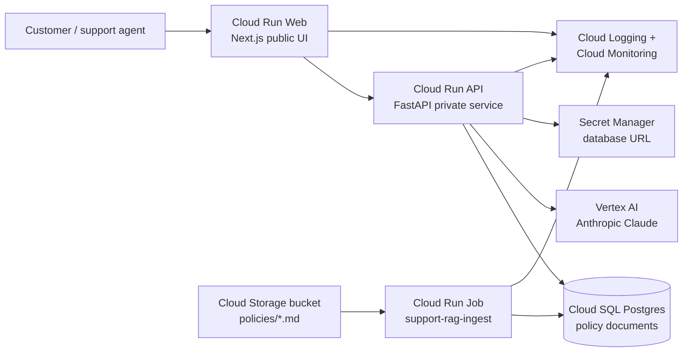
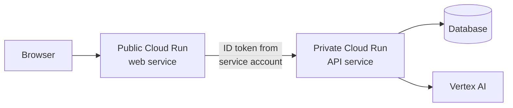

# Deploy AI Systems on Google Cloud With OpenAI Codex

> Companion repository for the YouTube video [How I Deploy Real AI Systems With OpenAI Codex](#).

This is the engineering reference behind the video. It mirrors the video's flow (intro, deployment options, why agents matter, the demo architecture, and the operating model) with the depth and references you'd want when you actually go to ship something.

The video deploys a customer-support RAG application live, end to end. The demo app source lives in a separate repo, linked in the description.

---

## Intro

When I started my freelance business, this was the problem that almost broke me.

I could build AI applications. That part was easy. AI coding tools made building software faster than ever. What I couldn't figure out was how to deploy them properly. How to put them in front of real customers, behind a real URL, on infrastructure that wouldn't fall over. How to manage multiple client projects, billing, costs, scaling, and production inference. All as a solo developer. It felt overwhelming.

The cloud is the right answer technically. It's also genuinely hard if you've never used it. Permissions are a nightmare, documentation is dense, pricing is opaque, enterprise terminology everywhere. It can feel like you need a PhD to operate these platforms. And I say that as someone who's been doing it for 20 years.

That tension is exactly the gap AI coding agents close.

The kind of work in this tutorial (provisioning a GCP project, wiring minimum-scope IAM, deploying containerised services, setting up dashboards and alerting, bolting on continuous deployment) used to take a team of engineers two to three weeks. With Codex as a deployment partner, I do it in an afternoon.

Not because the work got easier. The cloud didn't get simpler. The shift is that the boring parts are now generated, the cryptic errors are now explained, and the operational discipline is now defaulted into. This repo is how to actually do that work.

---

## Three Ways to Deploy

Each has tradeoffs. There's no perfect answer.

### Self-managed VPS

Renting a Linux box from Digital Ocean or Hetzner and managing it yourself. Cheap, simple to start. The moment you scale or take on multiple clients, you're managing load balancers, configuring nginx, fighting SSL, writing your own backups. I love simplicity. I just don't want to be a part-time DevOps operator anymore.

### Managed PaaS

Vercel, Railway, Render, Fly. Push code, they run it. Fantastic for small projects. The moment a client wants a real database, scheduled jobs, or production-grade AI inference, the platforms hit a ceiling. As soon as your projects get real, you outgrow them.

### Cloud providers

Google Cloud, AWS, Azure. The technically right answer. The wrong answer if you've ever opened the AWS console and wanted to cry. The complexity is real, but it's exactly what AI coding agents fix.

This repo lives on Google Cloud. Reasons: tight integration of compute, database, secrets, monitoring, and Vertex AI for production model calls; one auth surface; one bill; observability defaults that don't suck.

---

## Why AI Agents Change the Game

The real value of an AI coding agent on cloud work is that it unblocks you the moment you get stuck.

**You hit a permission denied error.** Twenty minutes of hunting through IAM roles becomes thirty seconds. Paste the error, role added, you're moving.

**You need to set up a service you've never used.** Half an hour of reading docs becomes a few seconds and a working command.

**You ship something and you're not sure whether your IAM is too loose or you've left a debug flag on.** The audit you'd usually put off until later becomes a five-second prompt now.

The cloud's pain points haven't gone away. They've been turned into mechanical work that an agent handles in seconds while you keep moving.

The agent doesn't replace your engineering judgment. It removes the friction that stopped you from acting on it.

### What you still own

- The architecture itself. Public/private boundaries, database choice, where state lives.
- The security model. The agent will reach for "the simple thing" which might not be the compliant thing. If you have data residency, multi-region, or specific security requirements, write them into your `AGENTS.md`.
- Verifying what the agent does. Read the diff. The viewers who get the most out of Codex on deployment are senior engineers who can verify what it produces.
- The deploy button on a system with real users. See the operating model in the Summary.

The agent is a partner. You're still the engineer.

---

## Demo: App Architecture

The video deploys a customer support RAG app for an e-commerce store. Three runtime services, one database, one bucket, one model.

The browser only ever talks to the public Next.js web service. The web service calls the private API from server-side route handlers, using Google identity-token auth so the API never has to be exposed publicly. The ingest job is a separate runtime that syncs markdown policy documents from Cloud Storage into Postgres. All three runtimes share the same Cloud Logging and Cloud Monitoring stack, with no extra setup.

For the deeper architecture story (request flow, background job flow, permissions model, briefing a coding agent), see [`architecture.md`](architecture.md).

### The patterns this app uses

The same six patterns power most production AI apps on GCP. Once you've deployed one, you can deploy any of them.

**Cloud Run for stateless services.** Web apps, APIs, webhook receivers. HTTPS, autoscaling, scale-to-zero, IAM-bound service accounts, zero server management. The default container runtime for production AI apps. Don't reach for GKE; you don't have those problems.

**Cloud Run Jobs for finite work.** Document ingest, batch enrichment, scheduled cleanup, embeddings backfill. Same image as your service, same auth, triggered manually or by Cloud Scheduler.

**Public web, private API.** Don't expose your backend if you don't have to. The web service is public, the API is private. The web service mints a Google ID token from its runtime service account to call the API. Costs nothing extra, blocks an entire class of attacks.

**Vertex AI over direct model APIs.** For production AI inference on GCP, Vertex AI gives you a published SLA tied to your GCP agreement, IAM-based auth, unified billing, observability under one pane, and multi-model under one auth surface. Reach for direct APIs only for day-zero access to a brand-new model or when you're not on GCP.

**Cloud SQL for relational data.** A managed Postgres instance for documents, conversations, audit trails, operational state. The only fixed monthly cost in this stack at low traffic, so the database size matters more than the service sizing. `db-f1-micro` is fine for a low-traffic demo. Move to dedicated-core for a real production support system. Backups are not optional: daily, 7-day retention minimum, point-in-time recovery on.

**Cloud Storage for blob data.** Markdown documents, PDFs, audio files, model artifacts. The source of truth for documents in a RAG system; the database is the runtime.

### The five (six) services you actually need

That's the entire stack for almost every production AI app:

1. **Cloud Run** (or Cloud Run Jobs): runs your code
2. **Cloud SQL** (or Firestore for key-value): stores your data
3. **Secret Manager**: stores your secrets
4. **Vertex AI**: runs your model calls
5. **Cloud Storage**: stores documents and artifacts
6. **Cloud Logging and Cloud Monitoring**: tells you what's happening (free, automatic)

Ignore the other services until you have a specific reason. Pub/Sub, BigQuery, VPC Service Controls, GKE, App Engine, Dataflow. They're solving problems you don't have yet.

---

## Summary

### The production operating model

Is it safe to let AI agents touch production infrastructure?

Honest answer: use them for everything except the production button.

When you're setting up a new system, agents are extraordinarily useful. They handle the parts that used to take days. There's no real risk because nothing is in production yet.

Once you're shipping to real users, the discipline changes. The agent should still help you. The agent shouldn't be the thing pushing the deploy button.

The pattern I use on every client project:

1. **Use the agent to discover and prove the deployment.** Plan, run commands, debug IAM, capture the snags.
2. **Capture the working setup.** Resource names, IAM roles, environment variables, smoke tests. Write the runbook.
3. **Move repeatable deploys into Cloud Build.** From this point forward, code changes ship through CI.
4. **Use scoped service accounts and reviewable configuration for ongoing changes.** Production changes happen via reviewed PRs, not interactive `gcloud` commands.
5. **Treat manual commands as setup or break-glass operations, not the normal release path.**

That's the line. Agents help you discover the deployment. Automation runs it.

**Cloud Build over Cloud Deploy** for most apps. Cloud Build is build-and-deploy on every push. Cloud Deploy is release management with promotion, approvals, canary releases. For a single-environment app, Cloud Build is enough. Cloud Deploy starts to matter when you have dev/staging/prod or audit-heavy workflows.

**Cloud Build over GitHub Actions** for GCP-native apps. Built into GCP, uses Google IAM directly, no Workload Identity Federation setup, no OIDC token round-trip. GitHub Actions wins when your CI surface spans GitHub-hosted services.

### Cost model

For a low-traffic AI app on this architecture:

| Service | Approximate cost (low traffic) | Notes |
|---------|--------------------------------|-------|
| Cloud Run web | <$1/month | Scales to zero |
| Cloud Run API | <$1/month | Scales to zero |
| Cloud Run Job (manual) | cents | Charged per execution |
| Cloud SQL `db-f1-micro` | ~$8/month + storage/backups | Always-on, fixed cost |
| Cloud Storage | <$1/month | Pennies for small doc volumes |
| Artifact Registry | <$1/month | Negligible for a few images |
| Cloud Build | free tier covers this | 120 build-minutes/day free |
| Vertex AI | depends on tokens | Usage-based |

Realistic baseline: $10-15/month plus inference. The database is the only fixed cost worth thinking about. Set a budget alert before you leave anything running.

### Going deeper

- **AI Engineer Skool**: [aiengineer.co](https://aiengineer.co). $79/month community where I teach this kind of work in depth.
- **Gradient Work**: [gradientwork.com](https://gradientwork.com). The agency where I build production AI systems for clients.
- [`architecture.md`](architecture.md): full architecture story with request flow, background job flow, permissions model, and how to brief a coding agent.
- [`checklist.md`](checklist.md): the 10-step opinionated GCP project setup I use on every new client system.

### Other examples in this repo

- [`email-classifier/`](email-classifier/): a Cloud Run Job that classifies new Gmail messages with Vertex AI Gemini and applies labels. Useful as a minimal scheduled-automation pattern.
- [`proposal-generator/`](proposal-generator/): a small client-proposal generator built on the same primitives. Useful as a prompt-engineering-on-Vertex-AI pattern.
- [`terraform/`](terraform/): a reference Terraform module for the email-classifier Cloud Run Job, including monitoring dashboard and alerting.

---

## License

MIT. Fork it, ship it, modify it. Credit appreciated but not required.
