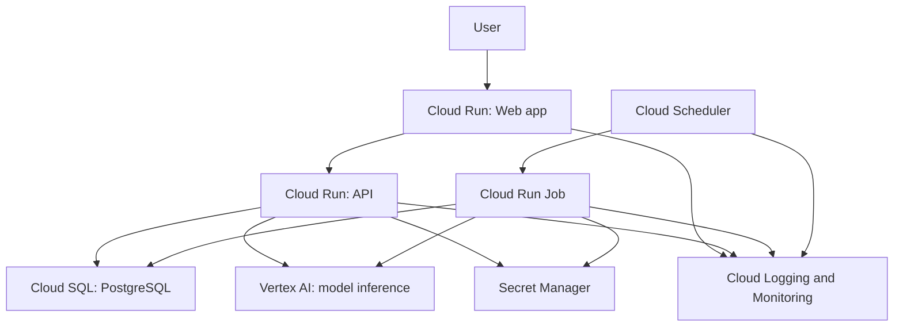
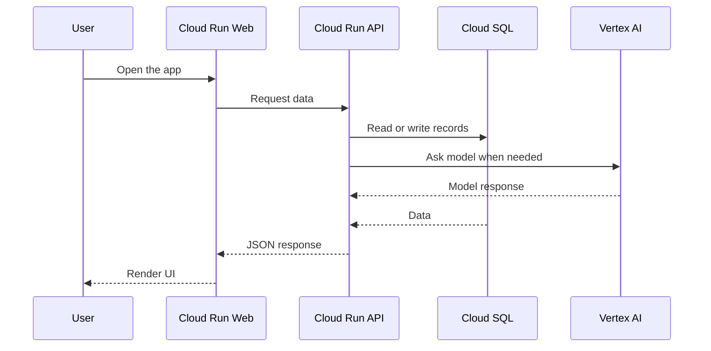
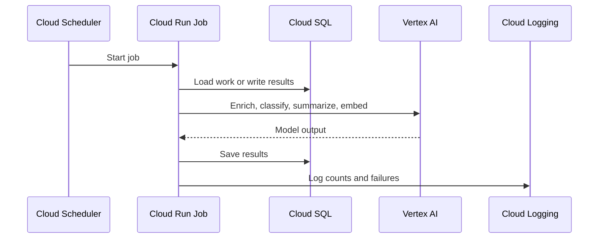
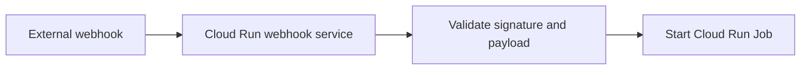
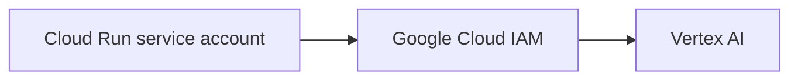
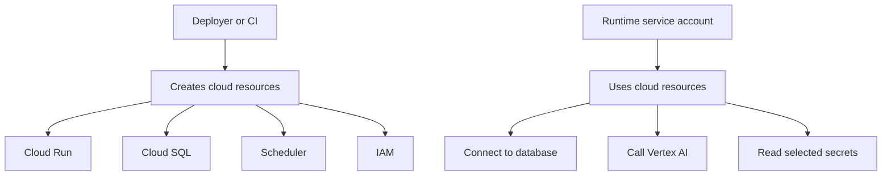

# Google Cloud Architecture For AI Applications

This guide explains the architecture, not every command.

The aim is simple: run an AI application on Google Cloud in a way that is easy to deploy, easy to operate, and easy for coding agents to understand.

## Architecture At A Glance



This is the whole stack:

- Cloud Run runs the web app and API.
- Cloud Run Jobs run background tasks.
- Cloud Scheduler starts jobs on a timer.
- Cloud SQL stores application data.
- Secret Manager stores private values.
- Vertex AI runs AI model calls.
- Cloud Logging and Cloud Monitoring show what is happening.

## Why Cloud Run Is The Center

Cloud Run is where you deploy containers.

That is useful because most modern apps can be packaged as containers:

- a Next.js web app
- a FastAPI or Node API
- a Python worker
- a small webhook receiver
- an internal admin tool

Cloud Run gives you HTTPS, scaling, logs, revisions, service accounts, and IAM integration without managing servers or Kubernetes.

For a small production AI app, that is a strong default.

## Request Flow



A common setup is:

- the web app is public
- the API is private
- the web app calls the API using Google identity
- the API talks to Cloud SQL and Vertex AI

You can also make the API public and use app-level authentication. That is a valid design too. The important thing is to be clear about which services are public and which are private.

## Background Job Flow



Cloud Run Jobs are good for work that starts, runs, and exits:

- imports
- scraping
- enrichment
- summaries
- embeddings
- report generation
- cleanup
- backfills

Cloud Scheduler is the timer. It can run the job every hour, every morning, or on any cron schedule.

If a third-party webhook should start a job, use a small Cloud Run service as a bridge:



That keeps the public webhook endpoint separate from the job runner.

## Vertex AI In This Architecture

Vertex AI is where the app calls AI models.

The useful part is that, when your code runs on Cloud Run, you usually do not need to manage a model API key for Vertex AI.

Instead:



The Cloud Run service runs as a Google service account. Your code uses Google client libraries or Application Default Credentials. Google Cloud handles the credentials. Vertex AI checks IAM to decide whether that service account can call the model.

That means:

- no Vertex AI API key in your app config
- no model provider secret in your container
- no long-lived key file checked into the repo
- permissions are controlled with IAM

You still need to:

- enable the Vertex AI API
- give the runtime service account permission to call Vertex AI
- choose the model and region
- accept partner model terms if using a partner model such as Claude through Vertex AI

Secret Manager is still useful for other private values, like database passwords, webhook secrets, and third-party API keys.

## Service Responsibilities

| Service | What It Does | Why It Is Useful |
| --- | --- | --- |
| Cloud Run | Runs web apps, APIs, and webhook services as containers | Simple container hosting without managing servers |
| Cloud Run Jobs | Runs finite background tasks | Good for scheduled jobs, enrichment, imports, and backfills |
| Cloud Scheduler | Starts work on a cron schedule | Simple timer for jobs and maintenance tasks |
| Cloud SQL | Managed PostgreSQL database | Durable relational data without running Postgres yourself |
| Secret Manager | Stores private values | Keeps passwords and secrets out of code and images |
| Vertex AI | Runs model inference | Google-managed AI access with IAM-based auth |
| Artifact Registry | Stores container images | Cloud Run deploys images from here |
| Cloud Build | Builds container images | Useful when you do not want to build locally |
| Cloud Logging | Stores logs | Lets you inspect services and jobs |
| Cloud Monitoring | Dashboards and alerts | Tells you when something is broken |

## Permissions Model

There are two different permission problems:



The deployer needs permission to create and update infrastructure.

The running app needs permission to use the things it depends on.

Those are not the same.

For a simple app, one runtime service account can be enough. For a stricter production setup, you might split it:

- web service account
- API service account
- job service account
- scheduler service account
- CI/deployment service account

Both approaches are valid. The right answer depends on the team, the risk, and the organization.

The principle is stable: give each identity the access it needs.

## What A Coding Agent Should Do

This architecture is a good fit for coding agents because most of the hard work is mechanical:

- write Dockerfiles
- create `gcloud` commands or Terraform
- choose resource names
- create service accounts
- wire Cloud Run to Cloud SQL
- add Secret Manager references
- deploy Cloud Run Jobs
- add Scheduler triggers
- add smoke tests
- inspect permission errors
- update the runbook

Give the agent the architecture and constraints. Let it produce the exact setup.

Useful agent prompt:

```text
Deploy this app to Google Cloud using this architecture.

Use Cloud Run for the web app and API.
Use Cloud Run Jobs for background work.
Use Cloud Scheduler for scheduled jobs.
Use Cloud SQL PostgreSQL for application data.
Use Secret Manager for private values.
Use Vertex AI for model inference.
Use Google Cloud IAM/service-account auth for Vertex AI, not app-managed API keys.
Keep the setup simple, but explain permission choices.
Do not assume there is only one valid IAM layout.
Write repeatable deployment commands or infrastructure code.
Add smoke tests and a short runbook.
```

## The Mental Model

Keep the architecture in your head like this:

```text
Cloud Run runs the app.
Cloud Run Jobs run background work.
Cloud Scheduler starts jobs.
Cloud SQL stores data.
Secret Manager stores private values.
Vertex AI handles AI calls through Google IAM.
Logging and Monitoring help you operate it.
```

That is the architecture.

The exact commands and IAM bindings can vary. A coding agent can help choose and implement those details for the project in front of it.
