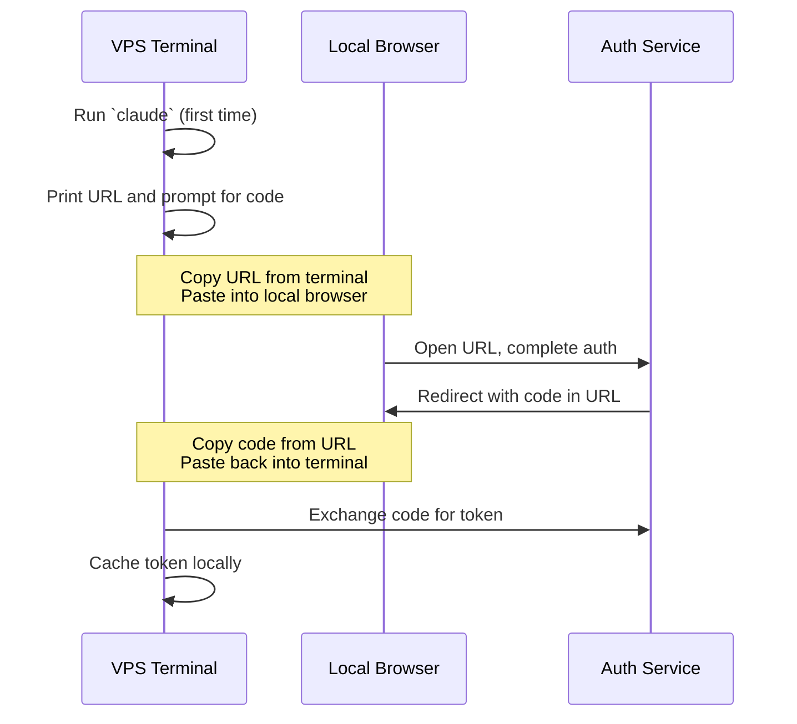

# 02 — Install Claude Code on the VPS

Claude Code is Anthropic's coding-focused CLI agent. We're installing it on the VPS so Multica can delegate coding tasks to it remotely.

## Install

```bash
sudo npm install -g @anthropic-ai/claude-code
claude --version
```

If `claude --version` fails with "command not found", npm's global bin isn't in your PATH:

```bash
echo 'export PATH="$(npm config get prefix)/bin:$PATH"' >> ~/.bashrc
source ~/.bashrc
```

## Set the API key

Use an API key, not a Pro/Max account. Programmatic CLI use under Pro/Max accounts is a gray area in Anthropic's Consumer ToS; the API key is the clean compliance path.

1. Get an API key at [console.anthropic.com](https://console.anthropic.com/)
2. Add to your VPS environment:
   ```bash
   echo 'export ANTHROPIC_API_KEY="sk-ant-..."' >> ~/.bashrc
   source ~/.bashrc
   ```
3. Verify:
   ```bash
   echo $ANTHROPIC_API_KEY
   ```

## The headless OAuth dance (the gotcha)

When you first run `claude` on the VPS, or when you add an OAuth-based MCP, the auth flow expects to open a browser. **There is no browser on a VPS.**

Claude Code handles this gracefully. It prints a URL to the terminal. The flow:



Steps:

1. Run `claude` (or whichever command triggers auth)
2. It prints something like:
   ```
   To complete authentication, open this URL in your browser:
     https://console.anthropic.com/oauth/authorize?...
   Then paste the code below and press Enter:
     >
   ```
3. **Copy the URL from your VPS terminal** (highlight, ⌘C in iTerm or your local terminal)
4. **Paste it into your local browser**
5. Complete the auth flow in the browser
6. The browser redirects to a callback URL with a `code=` query parameter
7. **Copy that code back to your VPS terminal** and paste at the prompt

That's the dance. Same shape for any OAuth flow on a headless server.

## First run (one time, even if you intend to use Claude Code headlessly)

```bash
claude
```

Reasons to do this once:

1. **Validates the API key** before Multica tries to invoke Claude Code.
2. **OAuth-based MCPs cache tokens** on first interactive auth. Future headless runs use the cached tokens.

Type a quick test message ("hello"), confirm a response, then exit with `/exit`.

## Test headless invocation

This is what Multica will do:

```bash
echo "What is 2+2?" | claude -p
```

You should see `4` (or a brief response). If this works, Multica can invoke Claude Code the same way.

## Adding MCP servers (more headless OAuth)

MCPs let Claude Code talk to external services (Notion, GitHub, Filesystem). Many require OAuth. Same headless dance applies.

### Example: Notion MCP

```bash
claude mcp add notion --command "npx -y @notionhq/notion-mcp-server"
```

Then run `claude` interactively:

```bash
claude
```

The first time you ask Claude Code to do something with Notion, it'll trigger OAuth. Same dance:

1. Claude prints a Notion auth URL
2. **Copy URL from VPS → paste into local browser**
3. Click Allow on Notion's OAuth screen
4. Notion redirects to a callback URL with a code
5. **Copy the code back to your VPS terminal** and paste at the prompt

Tokens cache. Headless `claude -p` runs from now on can use Notion without re-auth.

### Verify headless Notion works

```bash
claude -p --mcp-config ~/.claude.json "Add a row to the AI News Digest database with today's date"
```

If this works without prompting, you're set.

## Common issues

- **"command not found: claude"** — npm global bin isn't in PATH. See install step.
- **OAuth code expired** — codes are short-lived. Restart the auth flow and complete it faster.
- **Localhost redirect** — some flows redirect to `http://localhost:port/callback?code=...`. Just grab the `code=` value from the URL bar in your local browser and paste it back into the VPS terminal. Localhost won't actually load anything (no browser on the VPS), but the code in the URL is what you need.
- **MCP not loading in headless mode** — pass `--mcp-config ~/.claude.json` and `--permission-mode bypassPermissions` when invoking non-interactively.

## The principle

OAuth flows can't run unattended. They require a human clicking "Allow" in a browser. That's by design. The workaround: do the OAuth dance once, interactively. Tokens cache. From then on, headless invocations use the cached tokens.

If a token expires or is revoked, redo the dance. Set a calendar reminder before expiration.

## Next

[03 — Install Hermes Agent](../03-hermes-agent/)
