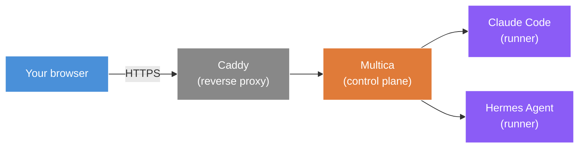

# 04 — Install and Configure Multica

Multica is the agent control plane. It gives you a Kanban board where you create tickets, route them to specialized agents, and watch the work get done. Multica is **vendor-neutral**: it can delegate to Claude Code, Hermes Agent, OpenAI Codex, Pi Agent, or any other AI agent you point it at.

This is the durable reason to use it. Hermes ships its own Kanban. OpenAI is building Symphony. Anthropic will likely add similar tooling. Multica's edge is being the abstraction layer that lets you swap or mix providers without changing your workflow.

## Install

> Confirm the current install command from the [Multica docs](https://multica.ai/) at the time you set this up. Multica is open-source and self-hostable.

Expected pattern (placeholder):

```bash
# Self-host install (likely Docker-based)
curl -fsSL https://multica.ai/install.sh | bash
# OR via Docker Compose
git clone https://github.com/multica-ai/multica.git ~/multica
cd ~/multica
docker compose up -d
```

## Open the firewall

```bash
# Find Multica's port (likely 8080 or 3000)
sudo ufw allow <multica-port>/tcp
sudo ufw reload
```

## First run

Open `http://<your-vps-ip>:<multica-port>` in your local browser. You should see the Multica dashboard.

Complete first-run setup:

- Create an admin user
- Set a workspace name
- Note the working directory you'll point agents at later (we'll clone a repo there in step 06)

## Verify Multica can see your runners

In Multica admin, confirm both Claude Code and Hermes are detected as available runners. If not, point Multica at the binary paths:

```bash
which claude   # likely /usr/bin/claude or similar
which hermes
```

## Optional: put Multica behind a real domain with HTTPS

For team access without exposing a raw IP, point a domain at the VPS and put Multica behind a reverse proxy.

Caddy is the simplest option (auto-provisions Let's Encrypt certs):

```bash
sudo apt install -y caddy

sudo tee /etc/caddy/Caddyfile << 'EOF'
agents.yourdomain.com {
    reverse_proxy localhost:<multica-port>
}
EOF

sudo systemctl reload caddy
```

Now `https://agents.yourdomain.com` reaches your Multica instance with a valid cert.

## Persistence and backup

Multica's state (tickets, agent configs, history) lives on the VPS. Back it up:

```bash
# Identify Multica's data directory (likely ~/multica/data or /var/lib/multica)
# Add to a daily backup. Example with restic:
restic -r /backup-target backup ~/multica/data
```

## Architecture so far



You have a control plane reachable over HTTPS, with both runners installed and detected. Now we need to give it work to do.

## Next

[05 — Configure specialized agents](../05-skills-and-agents/)
