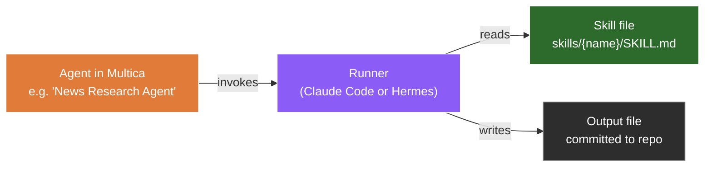
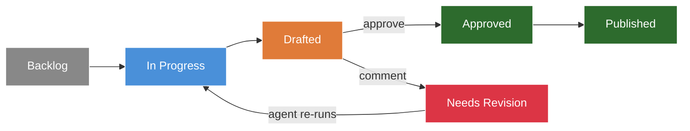

# 05 — Configure Specialized Agents

This is where the thesis lands. Each agent gets ONE job description and ONE skill file. No general-purpose chatbots.

## The pattern



The skill file IS the agent's job description. When Multica picks up a ticket assigned to an agent, it invokes the runner with the skill file's prompt as the system prompt.

## Skill file convention

In your Git repo (the one Multica is pointed at):

```
skills/
├── ai-news-research/
│   ├── SKILL.md
│   └── references/
│       └── sources.md
├── linkedin-post/
│   └── SKILL.md
├── substack-notes/
│   └── SKILL.md
├── kit-email/
│   └── SKILL.md
└── youtube-description/
    └── SKILL.md
```

Each `SKILL.md` is the job description. Brief, single-task, clear output requirements.

Example skill files are in [`skills/`](./skills/) — copy them as a starting point and adjust to your needs.

## Adding the agent in Multica

For each specialized role, create a Multica agent:

1. Open Multica → Agents → Add agent
2. **Name**: e.g. `News Research Agent`
3. **Runner**: Hermes (general-purpose) or Claude Code (coding)
4. **Working directory**: the path to your cloned repo on the VPS
5. **Skill / system prompt path**: `skills/ai-news-research/SKILL.md`
6. **Triggered by**: tickets assigned to this agent (or matching a title pattern)

> The exact UI fields will depend on the Multica version you install. Check Multica's docs and update these notes as you go.

## The starting team

Six specialized agents to start. Each has one job:

| Agent | Runner | Skill file | Job |
|---|---|---|---|
| News Research Agent | Hermes | `skills/ai-news-research/` | Daily AI news digest |
| LinkedIn Post Writer | Hermes | `skills/linkedin-post/` | Repurpose video to LinkedIn post |
| Substack Note Writer | Hermes | `skills/substack-notes/` | Repurpose video to Substack note |
| Kit Email Writer | Hermes | `skills/kit-email/` | Repurpose video to Kit promo email |
| YouTube Description Writer | Claude Code | `skills/youtube-description/` | Generate descriptions and chapters |
| Deployment Agent | Claude Code | `skills/deployment/` | Run deploy scripts, tag releases |

Each agent has one job. Don't combine. Specialize.

## Schedule the news agent

In Multica, create a scheduled automation:

- **Trigger**: every day at 07:00 in your timezone
- **Action**: create a ticket "Daily AI news digest" assigned to News Research Agent

Now the agent runs every morning without manual triggering. The digest appears in your repo (or Notion, depending on the agent's output destination) by 07:10.

## Verify the loop

Manually create a ticket assigned to one of your agents. Watch:



If this works for one agent, it works for all of them. The architecture is the same; only the skill file differs.

## The iteration loop

When you review a draft and it needs work, move the card back to "Needs Revision" with a comment. Multica re-runs the agent with the original input plus your comment. This is the loop most multi-agent demos skip — they show one-shot generation, not iteration. Real work is iterative.

## Next

[06 — Connect Multica to your Git repo](../06-git-access/)
