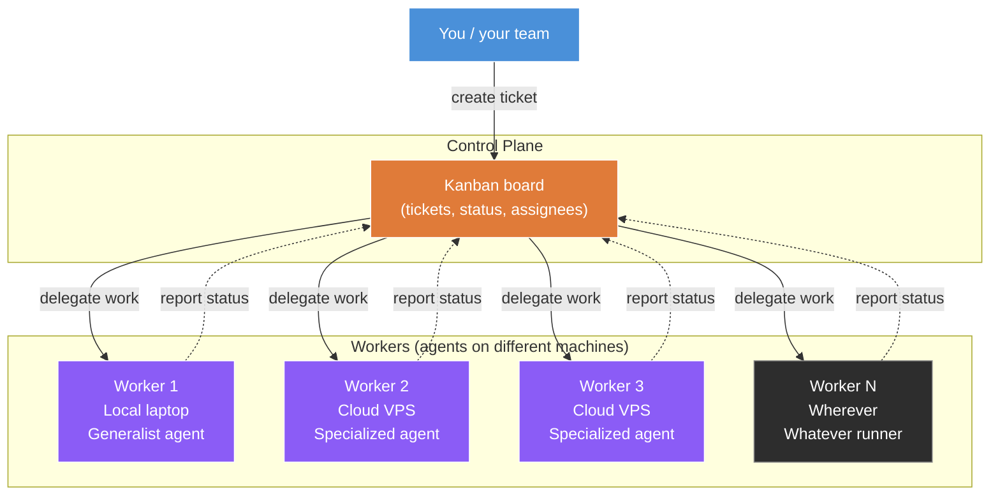
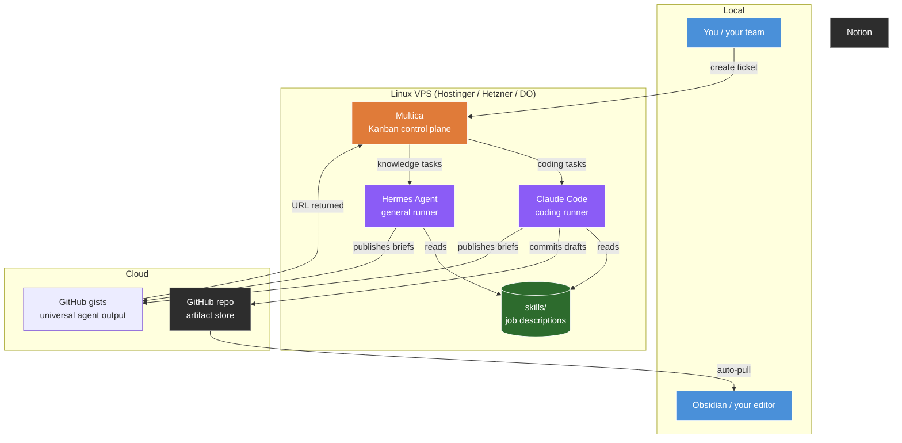
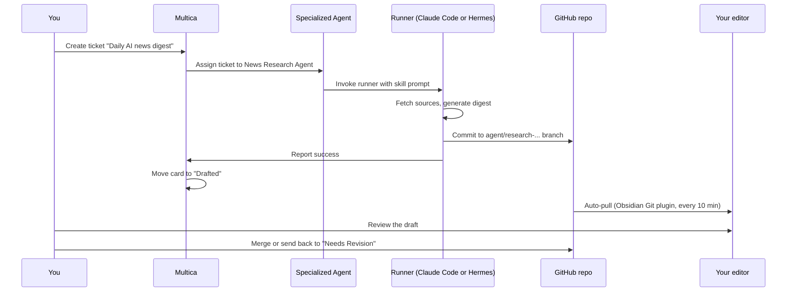

# Multica Turns Claude Code Into a Remote Teammate

Companion repo for the video. A complete, no-fluff guide to provisioning a Linux VPS, installing Claude Code on it, and connecting it to Multica so anyone on your team can delegate work to specialized remote agents.

The video focuses on one demo: a remote Claude Code research agent. This repo extends that pattern to additional specialized agents (Hermes, Codex, content repurposing) you can build after. Read top to bottom and you'll have the system running in about three hours.

## What this is

Most people use AI agents one chat at a time on their laptop. That isn't an AI team. It's a fancier search bar.

A real AI team is **specialized automations** with narrow scopes, running where your business runs (the cloud), accessible to anyone on your team, doing actual work in parallel. You delegate to them like to a contractor with a clear brief, not chat with them like an employee with a personality.

This guide builds that system end to end.

## What you'll have when you're done

- A small Linux VPS running [Multica](https://multica.ai/) as the agent control plane
- [Claude Code](https://docs.claude.com/en/docs/claude-code/) installed on the VPS as a coding-focused runner
- [Hermes Agent](https://hermes.dev/) installed on the VPS as a general-purpose runner
- Specialized agents in Multica, each backed by one skill file in a Git repo
- Team access: anyone on your team with the URL can delegate work

End cost: about $5-10 per month for the VPS plus your Anthropic and Hermes API usage.

## The pattern: control plane and workers

Before the specific tools, here's the abstract pattern this whole setup implements.

A **control plane** is a centralized place where you create and assign work. **Workers** are the things that actually do the work. Workers can run on many different machines (your laptop, a VPS, multiple VPSs) but they all connect back to the same control plane. You delegate work through the control plane. The right worker picks it up, does the job, and reports back.

This is the same pattern as Kubernetes (control plane + worker nodes), CI runners (GitHub Actions central + runner machines), and most distributed work systems. We're applying it to AI agents.

Key properties of this pattern:

- **One control plane, many workers.** Workers can be added or removed without changing how you delegate.
- **Workers can be different.** Some are generalist agents on your laptop. Others are specialized agents on cloud VPSs. The control plane treats them uniformly.
- **The control plane is the abstraction.** You don't think about which machine a worker runs on. You think about what job the worker does.
- **Specialization happens at the worker, not the control plane.** Each worker has its own job description, its own tools, its own workflow. The control plane just routes tickets.

In our specific case, the control plane is **Multica** and the workers are **Claude Code, Hermes Agent, Codex, or any other AI agent runner** running on whichever machines you want.

## The architecture (concrete implementation)

The VPS is the durable home for the agents. The control plane is Multica. The actual LLM execution happens in Claude Code or Hermes, depending on the task.

Outputs follow one of two patterns:

- **Git commits to a branch** for engineering work (PRs, code changes). Reviewed in your editor via `git pull` or the Obsidian Git plugin.
- **GitHub gists** for knowledge work (research briefs, drafts, reports). The agent creates a private gist and returns the URL to Multica as the task result. This is the universal output pattern because it works across both runners and avoids MCP sandboxing issues with services like Notion.

## The thesis: what to delegate, what to keep

The biggest mistake people make with AI agents is delegating the wrong work. The skill is knowing what NOT to send to an agent.

Two-axis filter:

| Axis | Delegate when... | Keep yourself when... |
|---|---|---|
| **Verifiability** | Output is mechanical, checkable, has a right answer | Output is judgment-laden, ambiguous, "it depends" |
| **Iteration cost** | One-shot or near-one-shot is enough | Heavy back-and-forth review is required |

Concrete map:

| Do delegate | Don't delegate |
|---|---|
| Deployment pipelines | Original creative writing (essays, opinion pieces) |
| Research digests and monitoring | Architecture decisions |
| Content repurposing (your idea → new format) | Strategic thinking |
| YouTube descriptions, chapters, metadata | Anything you'd review every paragraph of |
| Small bug fixes (bounded scope) | Large refactors and complex bug fixes |
| Report generation and changelogs | Customer-facing communication where tone matters |

The rule: **if you'll iterate, you'll waste time. If it's mechanical and verifiable, you'll save time.**

The honest beat: don't use AI agents for creative writing. The "AI slop" problem comes from people delegating creative work that needs human thinking. Repurposing (mechanical transformation of your existing ideas) is fine. Original creation is not.

## Why Multica specifically

Hermes Agent already ships with its own Kanban. OpenAI is building Symphony. Anthropic will likely add something similar. Every provider will eventually offer this.

Multica's edge isn't features. It's that it's **vendor-neutral**. You can run Claude Code, Hermes, Pi Agent, OpenAI Codex, all of them, in the same Kanban. Pick the agent that fits the job, not the agent that ships with the dashboard you happen to be using.

Multica is the abstraction layer that prevents lock-in.

## The agents you'll build in this guide

The video demos **one** specialized agent: a remote Claude Code research agent that takes a topic, researches the top YouTube videos, and publishes a brief to GitHub. That demo is the entry point.

This repo extends to additional specialized agents you can build using the same pattern. Each one has ONE job and ONE skill file. Don't combine.

| Agent | Runner | Skill | Job |
|---|---|---|---|
| **YouTube Research** (in the video) | Claude Code on VPS | `skills/youtube-research/` | Topic → research brief on GitHub |
| News Research | Hermes (or Claude Code) | `skills/ai-news-research/` | Daily AI news digest |
| LinkedIn Post Writer | Hermes | `skills/linkedin-post/` | Repurpose video to LinkedIn post |
| Substack Note Writer | Hermes | `skills/substack-notes/` | Repurpose video to Substack note |
| Kit Email Writer | Hermes | `skills/kit-email/` | Repurpose video to Kit promo email |
| YouTube Description Writer | Claude Code | `skills/youtube-description/` | Generate descriptions and chapters |
| Deployment Agent | Claude Code | `skills/deployment/` | Run deploy scripts, tag releases |

The principle to take away: **specialized agents with structured workflows beat generalist agents prompted ad-hoc.** Build one specialized agent first. Add more once you've felt the pattern work.

## How it actually runs (the flow)

The Kanban states match the review states: `Backlog → In Progress → Drafted → Needs Revision → Approved → Published`. If you send a card back, the agent re-runs with the original input plus your comment.

## Setup, in order

Read these in order. Each one builds on the previous.

1. [01 — Provision a VPS](./01-vps-setup/) — Hostinger, base tooling, hardening
2. [02 — Install Claude Code](./02-claude-code/) — npm install, API key, the headless OAuth dance
3. [03 — Install Hermes Agent](./03-hermes-agent/) — install + configure
4. [04 — Install Multica](./04-multica/) — self-host, reverse proxy, first-run config
5. [05 — Configure specialized agents](./05-skills-and-agents/) — skill files, agent definitions, scheduled automation
6. [06 — Connect Multica to Git](./06-git-access/) — fine-grained PAT, gh CLI, manual PR test
7. [07 — Add team access](./07-team-access/) — Multica auth, multi-user, the verification test

The first three steps stand up the runners. The next three configure the team. The last step proves it works for someone other than you.

## When this is NOT the right pattern

The system is overkill if:

- You're a solo operator and never plan to share with a team — Claude Code on your laptop is fine
- Your "delegation" is really iterative collaboration — pair-program with Claude Code in your terminal instead
- You don't have any genuinely mechanical, verifiable work to delegate — solve that first; don't build infrastructure for nothing

The system is wrong if:

- You're trying to delegate creative writing — it'll produce slop
- You're trying to delegate architecture decisions — agents can't carry the context for these
- The cost of one bad output is catastrophic (legal docs, customer emails at scale, anything you can't easily reverse) — keep a human in every loop

## Things to watch out for

- **Token cost.** Multiple agents running in parallel costs roughly N times a single session. Make sure the parallelism is adding value.
- **OAuth on a server is a manual step.** Headless servers don't have browsers. The first time you authenticate Claude Code or any OAuth-based MCP, you'll copy a URL out of your terminal into your local browser, complete auth, then paste a code back. See [02 — Install Claude Code](./02-claude-code/) for the dance.
- **Same-file edits.** Two agents editing the same file will overwrite each other. Specialize each agent so they own different output paths.
- **Token rotation.** Fine-grained GitHub PATs expire every 90 days max. Set a calendar reminder.
- **Provider lock-in is sneaky.** It's tempting to consolidate on one vendor's tools as they ship more features. Resist if you can. The vendor-neutral setup outlives any one provider's product cycle.

## License

MIT. Take any of this and use it however you want.
