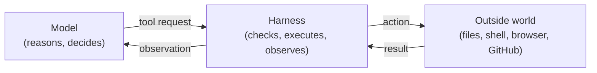
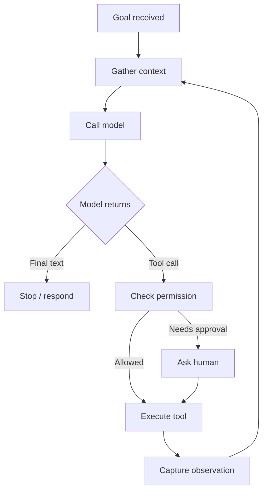
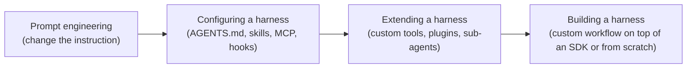
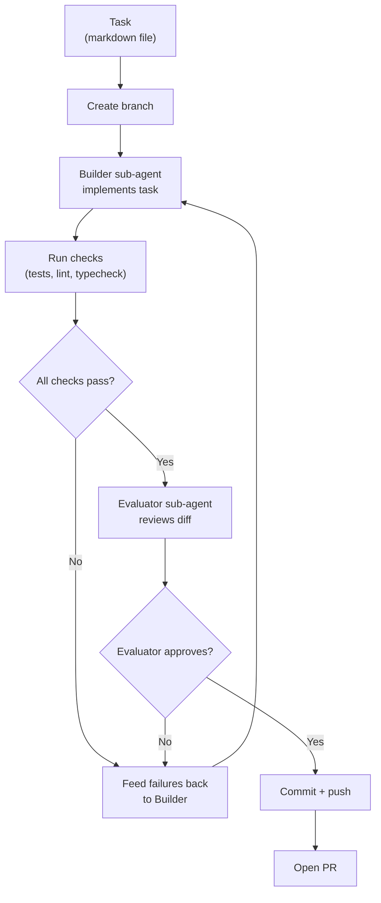

# Harness Engineering: A Technical Reference

A working explainer for engineers who want to understand what a harness is, what harness engineering is, why both matter, and how to build one. Optimized for clarity, not opinion.

---

## Table of Contents

1. [What is an agent harness?](#1-what-is-an-agent-harness)
2. [What is harness engineering?](#2-what-is-harness-engineering)
3. [Why harness engineering matters now](#3-why-harness-engineering-matters-now)
4. [The anatomy of a harness](#4-the-anatomy-of-a-harness)
5. [The agent loop](#5-the-agent-loop)
6. [Working backward from behavior](#6-working-backward-from-behavior)
7. [The configuration spectrum](#7-the-configuration-spectrum)
8. [The six surfaces of a harness](#8-the-six-surfaces-of-a-harness)
9. [Common failure modes](#9-common-failure-modes)
10. [Case study: a custom harness with Pi](#10-case-study-a-custom-harness-with-pi)
11. [When to build vs configure](#11-when-to-build-vs-configure)
12. [Running a harness in practice](#12-running-a-harness-in-practice)
13. [Where this is going](#13-where-this-is-going)

---

## 1. What is an agent harness?

A language model on its own is a text predictor. You send it text, it returns text. That is powerful, but it is not an agent.

An **agent** is what you get when you wrap that model in software that keeps state, calls tools, observes results, and loops until a goal is met. The software wrapper is the **harness**.

Put more precisely:

> A harness is the deterministic software around the model that gathers context, calls the model, exposes tools, executes tool calls, returns observations, manages permissions, runs hooks, enforces guardrails, stores state, and decides when to stop.

The formula:

```
agent = model + harness
```

The model decides what should happen next. The harness is the part that actually does anything.

### The split, in plain terms

- The model can say "I need to read `package.json`." The harness is what actually reads `package.json`.
- The model can say "I should run the tests." The harness is what actually runs the command, captures the output, and feeds it back.
- The model can say "open a pull request." The harness is what actually creates the branch, commits the diff, and calls the GitHub API.

> The model decides what to ask for. The harness decides what is possible. The harness performs the action.

### Visual



### Harness vs framework

A common confusion: people use "harness" and "framework" interchangeably. They are not the same.

| | Framework (LangChain, LangGraph, AutoGen, CrewAI) | Harness (Claude Code, Codex, Cursor, Pi, Aider) |
|---|---|---|
| **What you get** | Abstractions: chains, memory classes, state machines | A working agent, end-to-end |
| **Who assembles it** | You, the human, wire pieces together | The harness ships pre-wired |
| **The unit of customization** | The architecture | The configuration |
| **Mental model** | "Build an agent from parts" | "Configure an agent that exists" |

A harness is what you sit *in front of* and use. A framework is what you sit *behind* and build with. Modern harnesses ship as products (Claude Code, Codex) and increasingly as SDKs (Claude Agent SDK, Codex SDK) that let you customize the harness without rebuilding the whole loop.

---

## 2. What is harness engineering?

**Harness engineering is the practice of designing the system around a model so that an agent reliably finishes useful work.**

Crucially, it is a *practice* — not a framework, not a single tool, not a configuration file. It is the discipline of shaping the deterministic software that surrounds the model: the prompts, tools, context policies, hooks, sandboxes, permissions, sub-agents, feedback loops, and recovery paths.

Mitchell Hashimoto's working definition is the simplest:

> Harness engineering is the idea that anytime you find an agent makes a mistake, you take the time to engineer a solution such that the agent never makes that mistake again.

That captures the loop. The harness is built and rebuilt in response to observed failures. Every component earns its place because something went wrong without it.

### How it relates to other "engineering" terms

There are four overlapping practices people talk about. They are easy to confuse:

| Term | Scope |
|---|---|
| **Prompt engineering** | Wording the instruction you send the model |
| **Context engineering** | Choosing what information is in the model's context window at any moment |
| **Harness engineering** | Designing the software around the model — tools, loop, hooks, state, gates |
| **Agent design** | The overall shape of the system: which agents, what roles, what workflows |

These are not strictly nested, but in practice:

- Prompt engineering is the narrowest. It only changes the instruction.
- Context engineering is broader. It decides what is in the window.
- Harness engineering covers context engineering plus everything else (tools, loop, hooks, gates).
- Agent design sits on top of all of them.

If a single line is useful: **prompt engineering changes the instruction; harness engineering changes the environment**.

---

## 3. Why harness engineering matters now

For most of 2023 and 2024, the dominant view was that better models would solve the agent problem. If GPT-N can't finish your task, wait for GPT-N+1.

Two things changed in late 2025 and 2026:

1. **Models got capable enough that the bottleneck moved.** Capable frontier models (Opus 4.6, GPT-5.x, Gemini 3) can reason about real codebases, plan multi-step work, and use tools reliably enough that "the model is too dumb" is rarely the actual failure. The failure is usually: the agent had wrong context, wrong tools, no way to verify its work, or no way to recover from an error.

2. **The empirical evidence makes the case directly.** Three findings, all from late 2025 / early 2026:

### Terminal Bench 2.0

Anthropic's Claude Opus 4.6, running inside Claude Code, places around #33 on Terminal Bench 2.0. The same model placed in a different harness — one not post-trained alongside Claude Code — moves to roughly **#5**. Same model. Same benchmark. Twenty-eight positions of swing, attributable entirely to harness differences.

### Stanford + MIT, "Meta-Harness" (2026)

The same fixed LLM produced up to a **6× performance gap** on a single benchmark depending on how the harness around it was designed. The paper introduces an agent-driven search over harness code (Meta-Harness) and treats harness design itself as an optimization problem.

### ETH Zurich agentfile study (2026)

Across 138 agentfiles tested against real repos:

- Auto-generated `CLAUDE.md` / `AGENTS.md` files *hurt* performance and cost 20%+ more tokens.
- Carefully human-written files helped task resolution by only about 4%.
- Agents spent 14–22% more reasoning tokens processing context-file instructions, took more steps to complete tasks, and ran more tools — *without* improving resolution rates.

The lesson is not "don't write agent files." The lesson is that *unprincipled* configuration is harmful, and that careless harness work is worse than no work. Harness engineering is, among other things, the discipline of avoiding that.

### The bottom line

A capable model with a bad harness underperforms a less capable model with a good one. The gap between what today's frontier models can do and what most users see them do is mostly a harness gap.

---

## 4. The anatomy of a harness

A harness is not one thing. It is a stack of components, each delivering a specific behavior. Different harnesses arrange these differently, but the components have converged to a shared set.

| Component | What it does | Why it exists |
|---|---|---|
| **System prompt** | Static text injected at the start of every session | Tells the model who it is, what it can do, and the rules |
| **Repo instructions** (`AGENTS.md`, `CLAUDE.md`) | Project-specific instructions injected into the prompt | Encodes conventions, guardrails, and team standards |
| **Tools** | Functions the model can request: read file, edit file, run shell, etc. | The model can't act on the world without them |
| **Tool schemas** | The names, descriptions, and arguments of tools | The model reads these to decide what to use |
| **MCP servers** | External tool collections (GitHub, Linear, browser, databases) | Connects the agent to systems beyond the local filesystem |
| **Skills** | Reusable instructions and bundles loaded on demand | Encodes workflows, conventions, and reference material |
| **Sub-agents** | Sessions spawned by the main agent for scoped work | Isolates context; lets the main agent stay focused |
| **Permissions** | Rules about what tools can run automatically vs need approval | Prevents destructive actions and keeps the human in the loop |
| **Hooks** | Scripts that run at specific lifecycle points (before tool call, after edit, on stop) | Deterministic enforcement of policies the model would otherwise forget |
| **Context management** | Compaction, summarization, file offloading | Keeps the context window relevant as work grows |
| **Memory** | Files that persist between sessions | Lets knowledge from one session carry to the next |
| **Sandbox** | Isolated execution environment | Lets the agent run code safely |
| **Back-pressure** | Tests, type checks, builds, evals that gate progress | Forces the agent to verify its work before moving on |
| **Observability** | Logs, traces, cost and latency tracking | Lets you debug and improve the harness |

This is the surface area of harness engineering. Every entry is something you can configure, extend, or replace.

### Convergence

Look at the popular coding agents side by side and they look more like each other than their underlying models do:

| | Claude Code | Codex | Cursor | Aider | Pi |
|---|---|---|---|---|---|
| Agent loop | yes | yes | yes | yes | yes |
| Built-in tools | read/edit/bash | read/edit/bash | read/edit/bash | read/edit/bash | read/edit/bash |
| Context management | yes | yes | yes | yes | yes |
| Permissions | yes | yes | yes | yes | yes |
| Sub-agents | yes | experimental | yes | no | via extensions |
| Skills | yes | yes | partial | no | yes |
| Hooks | yes | no | partial | no | yes |
| MCP | yes | yes | yes | partial | yes |

The patterns are converging because the problem has a right answer. The interesting variation is no longer in the architecture; it is in what teams configure and build on top.

---

## 5. The agent loop

At the centre of every harness is a loop. The loop is the actual mechanism by which the agent does work.



In code, the loop is small. The shape of a minimal version:

```python
def run(goal, tools):
    messages = [{"role": "user", "content": goal}]
    while True:
        response = call_model(messages, tools)
        messages.append({"role": "assistant", "content": response.content})

        if response.stop_reason != "tool_use":
            return response

        tool_results = []
        for block in response.content:
            if block.type == "tool_use":
                result = execute_tool(block.name, block.input)
                tool_results.append({
                    "type": "tool_result",
                    "tool_use_id": block.id,
                    "content": result,
                })
        messages.append({"role": "user", "content": tool_results})
```

This is the engine. Real harnesses wrap it in everything else — permissions, hooks, sub-agents, context management — but the engine itself is small.

### The loop in plain English

1. The user gives the agent a goal.
2. The harness assembles context: the goal, the system prompt, repo instructions, recent history, available tools.
3. The model returns either a final answer or a tool call.
4. If a tool call: the harness checks permissions, runs the tool, captures the result.
5. The result becomes part of the next turn's context.
6. Loop until the model returns a final answer or hits a stop condition.

The whole point of the harness is to control what happens at each step. *Which* tools are available, *what* context the model sees, *whether* a tool call gets executed, *what* the result looks like when it comes back.

---

## 6. Working backward from behavior

The most useful way to design a harness is to start from the behavior you want — or the failure you keep seeing — and derive the harness piece that delivers it.

The principle: **every harness component exists because of something the model can't do reliably on its own.** If you can't name the behavior a component delivers, it probably shouldn't be there.

Examples:

| Behavior wanted (or failure observed) | Harness piece that delivers it |
|---|---|
| "Agent should know our project conventions" | `AGENTS.md` / `CLAUDE.md` |
| "Agent should be able to talk to Linear" | MCP server |
| "Agent should never push to `main`" | Permission rule or hook |
| "Agent should not declare done while tests fail" | Back-pressure (test runner that re-prompts on failure) |
| "Agent loses focus on long tasks" | Sub-agents (context firewall) |
| "Agent keeps forgetting to lint" | Hook that runs the linter on every save |
| "Agent burns context exploring the codebase" | Dedicated explore sub-agent that returns a summary |
| "Agent hallucinates tool names" | Trim tool list; expose only what the task needs |
| "Knowledge from yesterday's session is gone" | Memory file (`AGENTS.md`, decision log) |
| "Agent re-reads the same large file three times" | Cache reads in the harness, not the model |

This is the loop of harness engineering. Watch the agent fail. Name the behavior you wanted. Build (or remove) one piece. Repeat.

The corollary: every piece in your harness should be removable in principle. If you can't articulate what stops working when you take it out, it's not earning its place.

---

## 7. The configuration spectrum

"Harness engineering" covers a wide range of work. It is useful to think of it as a spectrum, not a single activity.



| Level | What you do | Who does this | Effort |
|---|---|---|---|
| **Prompt engineering** | Change the wording of an instruction | Everyone | Low |
| **Configuring a harness** | Write `AGENTS.md`, install skills, connect MCP servers, define permissions, set up hooks | Serious users of Claude Code, Codex, Cursor, Pi | Medium |
| **Extending a harness** | Write custom tools, MCP servers, plugins, sub-agents | Teams with recurring custom needs | Medium-high |
| **Building a harness** | Encode a full workflow as software, often on top of an agent SDK | Teams with workflows that repeat enough to justify the investment | High |

All four are harness engineering by most definitions in use today. They differ in depth, not in kind.

A useful test: if you're writing AGENTS.md to fix a behavior, you're at level 2. If you're writing a hook that runs your test suite and re-prompts on failure, you're between 2 and 3. If you're writing a Python program that orchestrates Builder and Evaluator sub-agents through a custom retry loop, you're at level 4.

Most people should start at level 2 and only move up when failures force them to.

---

## 8. The six surfaces of a harness

Within "configuring" and "extending," there are six configuration surfaces that recur across modern harnesses. This is the working list a serious user touches.

### 8.1 `AGENTS.md` / `CLAUDE.md`

A markdown file at the root of your repo that the harness injects into the system prompt on every session. The single highest-leverage configuration point because it lands in the prompt every turn.

Principles:

- **Keep it short.** Mature teams keep theirs under ~60 lines. Every line competes for attention.
- **Earn every line.** Each rule should trace to a specific past failure or a hard external constraint.
- **Avoid auto-generation.** The ETH Zurich study showed auto-generated agentfiles hurt performance. Hand-curate.
- **Don't list the repo structure.** Agents are good at discovering structure themselves.

Use it for: package manager, test framework, formatting conventions, "never touch this directory," "always use this logger."

### 8.2 MCP servers

The Model Context Protocol exposes external tool collections to a harness. Connect to GitHub, Linear, a browser, a database, etc.

Principles:

- **Tools cost tokens.** Every MCP server's tool descriptions land in your system prompt every turn. Too many tools and the context window fills before the agent does anything.
- **Prefer CLIs when possible.** If a tool is well-represented in training data (`gh`, `docker`, `psql`), prompting the agent to use the CLI often outperforms an MCP server that wraps the same thing.
- **Treat MCP servers as trusted text.** Tool descriptions are injected into the prompt; a malicious or sloppy MCP server can prompt-inject your agent.
- **Turn off what you're not using.** MCP tool search is increasingly available; until then, keep the active list short.

### 8.3 Skills

Skills are reusable instruction bundles that the harness loads on demand. Originally introduced by Anthropic for Claude Code, now supported by several harnesses including Codex and Pi.

The key idea is **progressive disclosure**: the agent gets specific instructions or tools only when the task calls for them. This avoids stuffing everything into the prompt at startup.

A skill is typically a directory with a `SKILL.md` file plus any bundled scripts, templates, or reference material. The harness shows the agent a short index of available skills; the agent loads a skill's contents when it decides the skill is relevant.

Skills are good for:

- Workflow instructions (how to write a spec, how to run a deploy)
- Reusable reference material (style guides, error code mappings)
- Reusable tools (a CLI or script bundled with usage instructions)

Skills are *not* the same as MCP servers. Skills are *instructions*; MCP servers expose *actions*.

### 8.4 Sub-agents

A sub-agent is a separate agent session that the main agent can spawn for scoped work. The dispatching agent sees only the prompt it writes for the sub-agent and the sub-agent's final result. None of the intermediate tool calls or messages end up in the main context.

This is sometimes called a **context firewall**.

The most common mistake is using sub-agents for *specialization* — a "frontend engineer" sub-agent, a "backend engineer" sub-agent. In practice this rarely helps; the model is the same model. The useful pattern is using sub-agents for **context control**: discrete tasks that would otherwise pollute the main context with intermediate work.

Good sub-agent use cases:

- Locating a definition in the codebase
- Tracing a request across service boundaries
- Running a long bash command and returning a summary
- Research tasks with many intermediate web fetches

A sub-agent should accept a tight prompt and return a tightly-scoped answer, with citations the parent can follow up on if needed.

Sub-agents are also a cost lever: use an expensive model for the parent session (planning, orchestration) and a cheaper model for sub-agents (search, summarization).

### 8.5 Hooks

A hook is a script the harness runs at a specific lifecycle point: before a tool call, after a file edit, before commit, on session start, on session stop.

Hooks are the deterministic enforcement layer. They are where rules go that the model would otherwise forget.

Common uses:

- **Verification:** Run typecheck, lint, build, or a fast test suite after every edit. Surface errors to the agent.
- **Safety:** Block destructive commands (`rm -rf`, `git push --force`, dropping tables) unless explicitly approved.
- **Integration:** Send a Slack message, open a PR, set up a preview environment.
- **Default behaviors:** Auto-format on write; auto-stage common files.

The governing principle: **success is silent; failures are verbose**. A passing typecheck adds nothing to the context. A failing typecheck injects the error into the loop and forces the agent to fix it before finishing.

Hooks are how you turn "the agent *should* do X" into "the system enforces X."

### 8.6 Back-pressure

Back-pressure is a class of harness mechanism that gates progress on verification. It is sometimes a hook, sometimes a sub-agent, sometimes a wrapper around the loop itself.

The principle: **the agent's likelihood of finishing real work is correlated with its ability to verify its own work.**

Examples of back-pressure mechanisms:

- A typecheck that runs on every "I'm done" attempt and re-prompts on failure
- A test runner that gates the PR step
- An evaluator sub-agent that scores work against acceptance criteria
- A linter that blocks commit on style violations
- A code-coverage report that re-prompts if coverage drops

Back-pressure is the difference between an agent that *says* it's done and one that *is* done. Most production-quality coding workflows lean heavily on back-pressure.

For back-pressure to be useful, it has to be context-efficient. A failing test should surface the error, not flood the context with 4,000 lines of passing test output. Standard pattern: capture full output, surface only failures.

---

## 9. Common failure modes

Patterns that consistently break agent runs. Worth memorizing.

### 9.1 Stuffing too much into context

The naive approach is to load every potentially-relevant instruction, file, and tool into the context at startup. This degrades performance before the agent takes a single action.

Symptoms: agent contradicts its own instructions, ignores rules in `AGENTS.md`, hallucinates tool names.

Fix: progressive disclosure. Skills, on-demand file reads, sub-agents.

### 9.2 Auto-generated agentfiles

Tools that auto-write `CLAUDE.md` / `AGENTS.md` produce verbose, generic files that hurt more than they help. The ETH Zurich data is clear on this: LLM-generated agentfiles slowed agents down and increased token cost without improving outcomes.

Fix: hand-curate. Keep it short. Earn every line.

### 9.3 Too many MCP servers / tools

Every MCP server's tool descriptions land in the system prompt. Plug in five MCP servers with 8 tools each and you've burned thousands of tokens before the agent reads its first user message.

Symptoms: slower responses, agent ignores tools that *are* relevant, agent picks the wrong tool.

Fix: turn off MCP servers you aren't actively using. Prefer CLIs over MCP wrappers when the CLI is well-known.

### 9.4 Sub-agents for specialization

"Frontend engineer," "backend engineer," "data analyst" sub-agents sound good but rarely work. The model is the same model. Splitting by job title does not give you a frontend specialist; it gives you the same model with a different prompt, and orchestration overhead.

Fix: use sub-agents for context control (scoped tasks, isolated work), not specialization.

### 9.5 Long-context fallacy

"Just use the million-token model" is not a substitute for context management. Bigger context windows let the agent see more, but they do not make the agent better at attending to what matters. Models still degrade with longer contexts (the "context rot" finding).

Fix: better context isolation, not bigger windows. Sub-agents, compaction, on-demand file reads.

### 9.6 Static system prompts

Treating the system prompt as a fixed document means the agent gets the same setup whether it's writing a migration or fixing a typo. The relevant context for those tasks is wildly different.

Fix: dynamic context. Inject task-specific information at the start of the work, not at the start of the session.

### 9.7 Missing or fragile back-pressure

Agents that can call themselves done without verification will. The harness has to push back.

Symptoms: PRs that don't compile, tests that were "fixed" by deletion, code that passes review but breaks in production.

Fix: hooks that gate "done" on real verification. Eval sub-agents. Test suites the agent has to satisfy.

### 9.8 Premature optimization

Spending more time on harness configuration than on shipping. Installing skills you don't use, writing hooks for failure modes you haven't seen, configuring sub-agents that never fire.

Fix: bias toward shipping. Add configuration in response to real failures. Remove configuration that doesn't earn its place.

---

## 10. Case study: a custom harness with Pi

Pi is a minimal coding agent designed to be extended. It ships with a small core (read, write, edit, bash) and exposes extension points for custom workflows. That makes it a good substrate for building a domain-specific harness — one designed around a specific workflow rather than general coding.

This section walks through one such custom harness: a build-and-evaluate workflow that takes a task, implements it, verifies it against deterministic checks, retries on failure, and opens a pull request when the work passes.

### The workflow



### The pieces, named by behavior

| Component | Behavior delivered |
|---|---|
| **Task markdown file** | The agent has a precise, written definition of what "done" means before any code is written |
| **Branch step** | Work is isolated; trivial to discard a bad run |
| **Builder sub-agent** | The implementation happens in an isolated context, separate from the orchestration layer |
| **Check runner** | The agent's claim of "done" is gated on deterministic verification, not the model's self-assessment |
| **Failure feedback loop** | Failures are surfaced as new context, forcing another iteration rather than a fatal error |
| **Evaluator sub-agent** | A second model with no shared context reviews the work — agents skew positive when grading themselves |
| **PR step** | A human gets the final review; nothing ships without it |

Every piece exists because of a specific behavior. Remove the eval gate, and the agent declares done on broken work. Remove the evaluator, and the builder gives itself a pass. Remove the branch step, and bad runs contaminate the main line.

### Why Pi

Pi is **harness-as-a-service** in miniature: a small, well-factored runtime with extension points. Building this workflow on Pi is *not* building from scratch. The agent loop, tool execution, and basic context management come from Pi. The workflow harness sits on top.

The same workflow could be implemented on the Claude Agent SDK, the Codex SDK, or a hand-written Python loop. The choice of substrate is about how much you want to write vs. inherit.

### What this demonstrates

This is harness engineering in its strongest form: encoding a specific engineering workflow as software around the model. The Builder doesn't decide to retry. The Builder doesn't decide to open a PR. The harness owns the workflow; the model owns the implementation of each step.

---

## 11. When to build vs configure

A working heuristic, in order of when to use each:

### Default: configure

Most users should configure an existing harness (Claude Code, Codex, Pi) and stop there. Write a careful `AGENTS.md`. Install the skills you actually use. Connect the MCP servers your work depends on. Set up permissions and a handful of hooks. That covers the majority of value.

This is the right starting point for almost everyone. It scales surprisingly far.

### Move to extend when:

- A specific tool or capability is missing across many tasks (write a custom MCP server or skill)
- A recurring failure mode needs deterministic enforcement (write a hook)
- A specific kind of scoped work keeps polluting the main context (write a sub-agent for it)

### Move to build when:

- You have a **repeatable workflow** that happens often enough to deserve being software
- The workflow has clear stages, gates, and pass/fail conditions
- You want to run the workflow non-interactively (CI, batch, on a schedule)
- You want to standardize the workflow across a team

The clearest signal that a workflow deserves to be built is: you find yourself typing the same multi-step prompt to a coding agent more than a few times. That's not a prompt — that's a workflow asking to become software.

### Bias toward shipping

Time spent on harness configuration that doesn't translate to faster shipping is waste. The signal that an addition is paying off is that the next agent run goes better. If it doesn't, the addition wasn't earning its place — pull it out.

---

## 12. Running a harness in practice

Designing a harness is one problem. Running one day-to-day — especially for long-running, multi-session work — is another. The patterns in this section are operational rather than architectural. Most come from Anthropic's writing on long-running coding agents and from teams running production harnesses today.

### 12.1 The session protocol

A long-running agent should follow a predictable lifecycle every time it starts work. Anthropic recommends an eight-step protocol:

1. **Orient.** Read recent progress notes, the task list, and recent git history. Know where the last session left off.
2. **Setup.** Run an init script that starts dev servers, applies migrations, or otherwise prepares the environment.
3. **Verify baseline.** Run the test suite. Confirm the previous session left the project in a working state.
4. **Select one task.** Pick the highest-priority incomplete item from the task list.
5. **Implement.** Build the feature.
6. **Test.** Verify through the actual application — UI, API, or end-to-end — not just unit tests.
7. **Update state.** Mark the task complete in the task file. Commit with a descriptive message. Write progress notes.
8. **Clean exit.** Confirm the application is in a working state for the next session.

This protocol exists because compounding bugs across sessions is one of the most common failure modes for long-running agents. The verify-baseline step in particular catches silent breakage early.

### 12.2 One task per session

A single agent session should attempt one task, not several. This prevents context exhaustion, keeps each session recoverable, and gives you a clean unit for git history.

You can relax this as the agent demonstrates reliability on a given codebase, but tighten it back the moment quality degrades.

### 12.3 Sprint contracts

Before implementation begins, the Generator (or Builder) and the Evaluator should agree on what "done" looks like for the current task. The Generator proposes what it will build and how success will be verified. The Evaluator reviews and signs off.

This is the operational variant of "writing down acceptance criteria before coding." It bridges the gap between a high-level task description and concrete, testable requirements. Most scope drift inside agent runs comes from a fuzzy definition of "done"; the sprint contract closes that gap before the agent starts writing code.

### 12.4 Structured state files

State the agent needs to read or write across sessions belongs on disk, not in context. Conventions worth following:

- **Task list in JSON, not Markdown.** Agents have a tendency to silently rewrite or reorder Markdown lists; JSON resists this. Rule: never remove or reorder items, only flip status from incomplete to complete.
- **Progress notes in free-form text.** What was accomplished, bugs found, decisions made, what to work on next. Written at the end of every session.
- **Plan or spec in the repo.** The original requirements live as a versioned file the agent can re-read.
- **Init script in the repo.** Environment setup is automated, not described.

Together these files form the repository's role as the **system of record**: anything the agent should know but didn't write in this session has to be in the repo, or it doesn't exist.

### 12.5 Git as safety net

Git history is the agent's recovery mechanism. The expected pattern:

- Commit after every successful task with a descriptive message.
- Read recent commits at the start of every session.
- Tag known-good states.
- When the agent breaks the codebase, the fastest fix is often `git reset --hard` to the last good commit and a re-run.

This last point is operationally important. When a session goes badly, two strategies are valid: prompt the agent to recover, or reset and re-run from a clean state. The reset-and-re-run path is usually faster, and a healthy harness makes it cheap by ensuring every commit is a known-good state.

### 12.6 Periodic plan regeneration

Task lists and plans drift. Over many sessions, the list will accumulate stale items, dropped context, and out-of-order priorities. Periodically delete the task list and have the agent regenerate it from the spec compared against the current codebase. This prevents the agent from grinding on a plan that no longer matches reality.

---

## 13. Where this is going

A few directions worth tracking.

### Harnesses don't shrink; they move

A common misconception: as models improve, harnesses become unnecessary. The actual pattern is different. Better models retire *some* harness components — the ones that were compensating for things the model can now do natively — and unlock new tasks that need *different* harness components.

For example: earlier Claude models had a tendency to wrap up work prematurely as they approached their perceived context limit. Harness designers wrote elaborate "you have more context, keep going" scaffolding. Opus 4.6 largely eliminated this behavior; that scaffolding is now dead code. But Opus 4.6 also made multi-day, multi-context-window work tractable, which created new harness needs: durable memory, structured handoffs, cross-session coherence.

The space of useful harness work doesn't shrink. It moves to whatever the new ceiling exposes.

### Harness-as-a-service

The shape of the platform is changing. The first wave of agent products gave you a chat interface to a harness (Claude Code, Cursor). The second wave gives you an SDK to the same harness (Claude Agent SDK, Codex SDK). The third — which is forming now — exposes harness primitives as a service: hosted sandboxes, managed sub-agent dispatch, persistent state, hooks-as-a-service.

The practical implication: you increasingly don't build a harness from zero. You compose one from primitives that exist as APIs.

### Meta-harness

The Stanford + MIT "Meta-Harness" work points at a future direction: harness design itself becomes an optimization problem an agent can search over. Given a benchmark and a base model, search across prompts, tool configurations, hook policies, and sub-agent topologies. The agent doesn't write the *target* code; it writes the harness that helps the *target* model write code.

This is early. But the trajectory is real, and it's another reason to take harness engineering seriously now: the people who understand how harnesses work will be the ones who can specify and steer the next generation of automated harness design.

### Convergence

The popular coding agents look more like each other than their underlying models do. They are converging on a shared set of primitives because the problem has a right answer. That convergence is good news: the shape of harness engineering is stabilizing, the surface area is becoming describable, and the techniques are portable across tools.

A skill learned with Claude Code transfers to Pi and Codex. A pattern that works in Cursor will work somewhere similar elsewhere. Harness engineering is now a real discipline, not a vendor lock-in.

---

## Glossary

| Term | Definition |
|---|---|
| **Agent** | A model wrapped in a harness so it can take actions in a loop toward a goal |
| **Agent loop** | The repeated cycle: gather context → call model → execute tool → observe → repeat |
| **AGENTS.md / CLAUDE.md** | Markdown file at the repo root, injected into the system prompt |
| **Back-pressure** | Verification mechanisms that gate progress on real checks (tests, evals, types) |
| **Context engineering** | Designing what information is in the model's context at any moment |
| **Context firewall** | A sub-agent that isolates its own context from the parent's |
| **Hook** | A script the harness runs at a lifecycle event |
| **Harness** | The deterministic software around the model |
| **Harness engineering** | The practice of designing that software |
| **HaaS** | Harness-as-a-service; treating harness primitives as APIs |
| **MCP** | Model Context Protocol; a standard for exposing external tools to harnesses |
| **Prompt engineering** | Designing the text instructions sent to a model |
| **ReAct loop** | Reason → Act → Observe pattern that most agent loops implement |
| **Skill** | A reusable bundle of instructions and optional tools loaded on demand |
| **Sub-agent** | A separate agent session spawned by the main agent for scoped work |
| **Tool** | A function the model can request the harness to execute |

---

## Suggested reading

- Viv Trivedy, *The Anatomy of an Agent Harness* (LangChain blog)
- Kyle (HumanLayer), *Skill Issue: Harness Engineering for Coding Agents*
- Birgitta Böckeler (ThoughtWorks), *Harness engineering for coding agent users* (martinfowler.com)
- Ryan Lopopolo (OpenAI), *Harness Engineering: How to Build Software When Humans Steer, Agents Execute* (AI Engineer Summit talk)
- Anthropic Engineering, blog posts on long-running agents and harness design
- Stanford + MIT, *Meta-Harness* (2026)
- Walking Labs, *Learn Harness Engineering* (online course)
