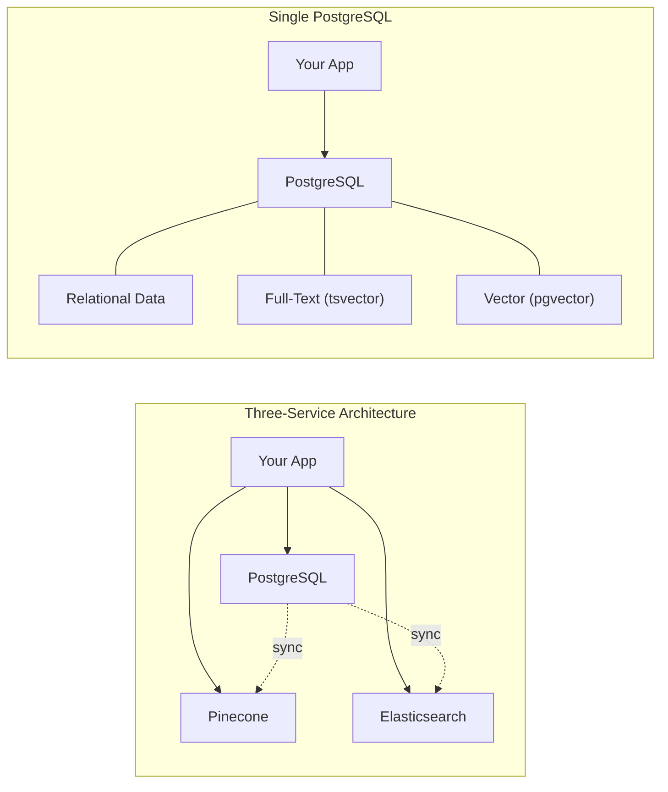

# Chapter 1: Why PostgreSQL Is the Only Database You Need for AI

One database handles vector search, full-text search, and relational data. No extra services required.

## The Problem

You want to build a RAG system. Every tutorial tells you to spin up a dedicated vector database -- Pinecone, Weaviate, Chroma, Qdrant. So now your architecture looks like this:

- PostgreSQL for your users, sessions, and application data
- Pinecone for your embeddings and vector search
- Elasticsearch for keyword search and filtering

Three connection strings. Three monitoring setups. Three billing accounts. And a sync problem -- keeping your PostgreSQL user data and your Pinecone embeddings in agreement. That sync problem bites you in production.

When you delete a document from PostgreSQL, do the vectors disappear from Pinecone? Not automatically. When you need to filter search results by user ID, can you JOIN your Pinecone results against your users table? Not without glue code.

## Core Concept

PostgreSQL with pgvector is not "a relational database that can also do vectors." It is a data platform that handles three distinct jobs in one place:

1. **Structured relational data** -- users, sessions, permissions, metadata
2. **Full-text search** -- keyword matching with tsvector and GIN indexes
3. **Dense vector embeddings** -- similarity search with pgvector and HNSW indexes

All three are queryable together. In the same transaction. With the same connection string.

## How It Works

The fragmented approach forces you to coordinate across services:

```
Your App --> PostgreSQL  (users, metadata)
         --> Pinecone    (embeddings, vector search)
         --> Elasticsearch (keyword search)
```

Every query that needs data from multiple services requires application-level coordination. You query Pinecone for similar documents, then query PostgreSQL to get metadata, then merge the results in your code.

The single-database approach eliminates that coordination:

```
Your App --> PostgreSQL
              ├── Relational data  (standard tables)
              ├── Full-text search (tsvector + GIN)
              └── Vector search    (pgvector + HNSW)
```

One schema. One connection. When you delete a document, the vectors go with it. When you query, you can JOIN vectors against your user table in a single SQL statement.

## Diagram



*Same capabilities, one system. No sync problem.*

## Key Takeaways

- Most RAG systems need relational data, keyword search, and vector search. PostgreSQL handles all three.
- The fragmented approach creates a sync problem between services that is hard to get right in production.
- One database means one connection string, one deployment, one set of backups, and one bill.
- pgvector is not a toy -- it handles hundreds of millions of vectors with HNSW indexes.
- PostgreSQL has been in production for over 35 years. It is the boring, reliable choice.

## Learn More

- [pgvector GitHub repository](https://github.com/pgvector/pgvector)
- [PostgreSQL Full-Text Search documentation](https://www.postgresql.org/docs/current/textsearch.html)
- [pgvector indexing guide (HNSW and IVFFlat)](https://github.com/pgvector/pgvector#indexing)

## What's Next

In the next chapter, you will set up PostgreSQL with pgvector using Docker and create the documents table with an HNSW index.
