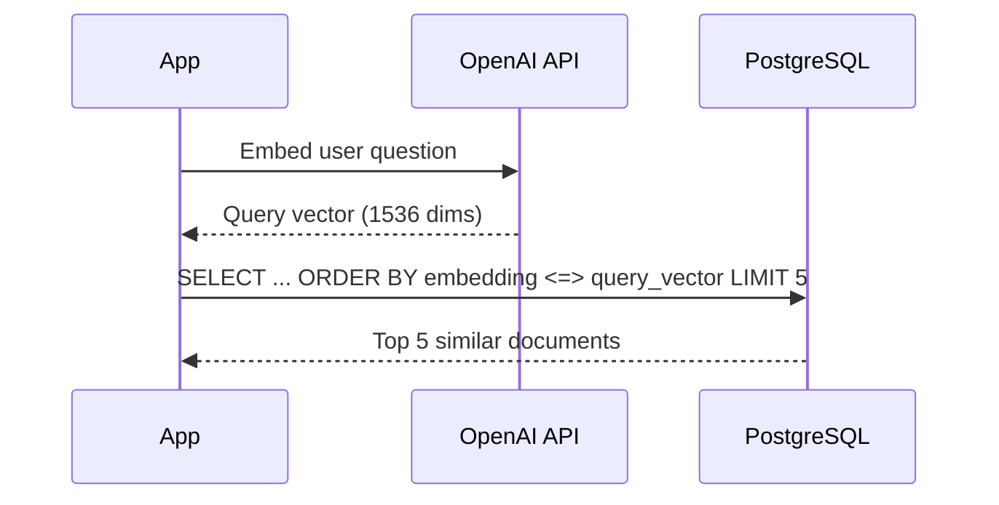

# Chapter 3: Vector Search with Cosine Distance

Query your documents by semantic similarity using pgvector's cosine distance operator.

## The Problem

You have a table full of documents with embeddings. A user types a question: "How does approximate nearest neighbor search work?" You need to find the documents that are semantically closest to that question -- not just keyword matches, but meaning matches.

With a dedicated vector database, you would call a proprietary API. With PostgreSQL, you write SQL.

## Core Concept

```sql
SELECT id, content, 1 - (embedding <=> $1) AS similarity
FROM documents
ORDER BY embedding <=> $1
LIMIT 5;
```

`<=>` is the cosine distance operator. `ORDER BY distance` returns the closest vectors first. `LIMIT 5` gives you the top 5 results. That is the entire query.

## How It Works

The cosine distance operator `<=>` computes the distance between two vectors. The value ranges from 0 (identical direction) to 2 (opposite direction).

To get a similarity score where higher is better, compute `1 - distance`. This gives you a value between -1 and 1, where 1 means identical.

The query flow:

1. Your application embeds the user's question using the same model that produced the document embeddings (e.g., `text-embedding-ada-002`)
2. The embedding vector is passed as a parameter to the SQL query
3. PostgreSQL uses the HNSW index to find the approximate nearest neighbors without scanning every row
4. Results come back ordered by distance, with the most similar documents first

## Diagram



*The application embeds the question, then PostgreSQL finds the nearest vectors.*

## Progressive Examples

### Basic similarity search

Find the 5 most similar documents to a query vector:

```sql
SELECT id, content, 1 - (embedding <=> $1) AS similarity
FROM documents
ORDER BY embedding <=> $1
LIMIT 5;
```

`$1` is a parameter placeholder for the query embedding. In Python with psycopg, you pass it as a parameter:

```python
cur.execute(
    "SELECT id, content, 1 - (embedding <=> %s::vector) AS similarity "
    "FROM documents ORDER BY embedding <=> %s::vector LIMIT 5",
    (str(embedding), str(embedding)),
)
```

### Similarity search with a threshold

Only return documents above a minimum similarity:

```sql
SELECT id, content, 1 - (embedding <=> $1) AS similarity
FROM documents
WHERE 1 - (embedding <=> $1) > 0.75
ORDER BY embedding <=> $1
LIMIT 5;
```

This filters out low-relevance results. A threshold of 0.75 is a reasonable starting point -- adjust based on your data.

### Similarity search with metadata filtering

Filter by metadata before computing similarity:

```sql
SELECT id, content, 1 - (embedding <=> $1) AS similarity
FROM documents
WHERE metadata->>'source' = 'pgvector-docs'
ORDER BY embedding <=> $1
LIMIT 5;
```

This is where PostgreSQL shines over dedicated vector databases. The WHERE clause uses standard SQL on the JSONB column. No separate filter API. No post-filtering in application code.

## Real-World Example

A complete Python function that embeds a question and searches for similar documents:

```python
import psycopg
from openai import OpenAI

client = OpenAI()

def vector_search(conn, question: str, limit: int = 5) -> list[dict]:
    """Find documents similar to the question using vector search."""
    # Embed the question with the same model used for documents
    response = client.embeddings.create(
        model="text-embedding-ada-002",
        input=question,
    )
    embedding = response.data[0].embedding

    with conn.cursor() as cur:
        cur.execute(
            """
            SELECT id, content, 1 - (embedding <=> %s::vector) AS similarity
            FROM documents
            ORDER BY embedding <=> %s::vector
            LIMIT %s
            """,
            (str(embedding), str(embedding), limit),
        )
        return [
            {"id": row[0], "content": row[1], "similarity": row[2]}
            for row in cur.fetchall()
        ]
```

## Common Mistakes

**Using different embedding models for documents and queries.** If you embed documents with `text-embedding-ada-002` (1536 dimensions) but query with a different model, the distances are meaningless. Always use the same model for both.

**Forgetting to cast the parameter to vector.** In psycopg, you need `%s::vector` to tell PostgreSQL to interpret the string as a vector type. Without the cast, you get a type error.

## Key Takeaways

- `<=>` is the cosine distance operator in pgvector. Lower distance means more similar.
- `1 - (embedding <=> query)` converts distance to similarity where higher is better.
- HNSW indexes make the query fast -- PostgreSQL does not scan every row.
- You can combine vector search with standard SQL WHERE clauses and JOINs.
- Always embed queries with the same model used for your documents.

## Learn More

- [pgvector: Querying](https://github.com/pgvector/pgvector#querying)
- [pgvector: Distance operators](https://github.com/pgvector/pgvector#distances)
- [OpenAI Embeddings API](https://platform.openai.com/docs/guides/embeddings)

## What's Next

Vector search captures semantic meaning, but it can miss exact keywords, acronyms, and technical terms. The next chapter adds full-text search to cover those gaps.
