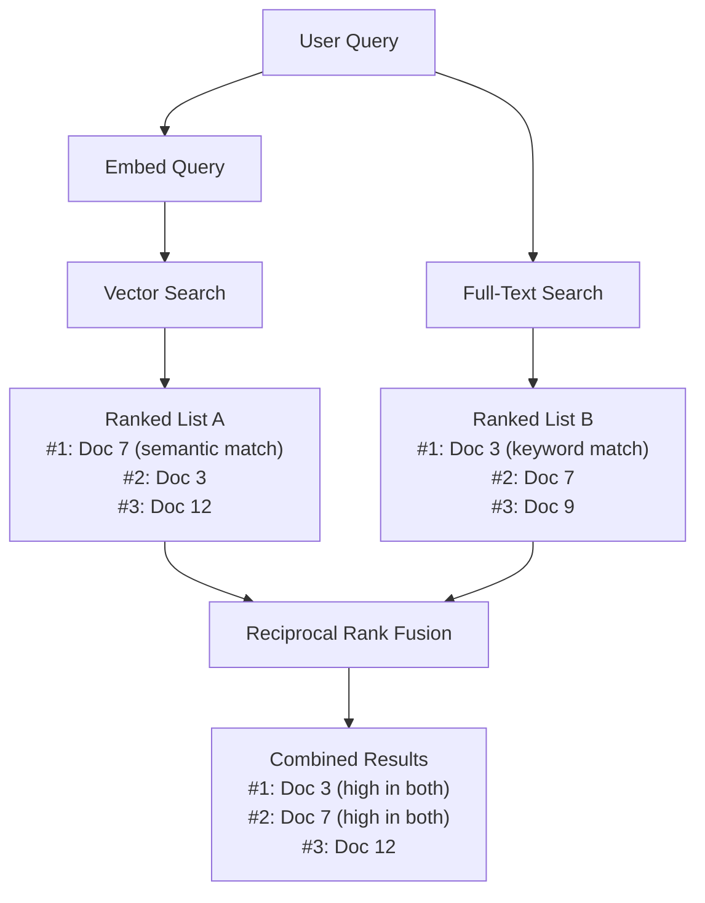

# Chapter 5: Hybrid Search with Reciprocal Rank Fusion

Combine vector search and full-text search into a single function that returns the best of both.

## The Problem

Vector search finds documents with similar meaning. Full-text search finds documents with matching keywords. Neither is complete on its own.

A user asks "How does the HNSW algorithm work in pgvector?" Vector search captures the semantic intent -- it finds documents about approximate nearest neighbor algorithms. But it might rank a general overview of indexing above the specific HNSW documentation. Full-text search finds every document containing "HNSW" -- but it has no concept of what the user actually means.

The best results come from documents that score well on both methods. That is what hybrid search gives you.

## Core Concept

```sql
SELECT * FROM hybrid_search(
    'how does HNSW work in pgvector',
    '[0.1, 0.2, ...]'::vector,
    10
);
```

One function call. It runs both search methods inside PostgreSQL, combines the ranked results, and returns the best matches. No application-level merging.

## How It Works

The hybrid search function uses Reciprocal Rank Fusion (RRF) to combine results. The intuition:

1. Run vector search -- get a ranked list of documents by semantic similarity
2. Run full-text search -- get a ranked list of documents by keyword relevance
3. For each document, compute an RRF score: `1/(k + rank_vector) + 1/(k + rank_fts)`
4. Documents that rank well in **both** lists get the highest combined score
5. Documents that only appear in one list get a lower score

The `k` parameter (default 60) controls how much weight high-ranked results get relative to lower-ranked ones. 60 is the standard value from the original RRF paper.



*Documents ranking well in both lists rise to the top.*

## Progressive Examples

### The complete hybrid_search function

This is the function from `sql/04_hybrid_search.sql`. Create it in your database:

```sql
CREATE OR REPLACE FUNCTION hybrid_search(
    query_text    TEXT,
    query_embedding vector(1536),
    match_count   INT DEFAULT 10,
    rrf_k         INT DEFAULT 60
)
RETURNS TABLE (
    id        BIGINT,
    content   TEXT,
    rrf_score FLOAT
)
LANGUAGE sql
AS $$
    WITH vector_results AS (
        SELECT
            id,
            ROW_NUMBER() OVER (ORDER BY embedding <=> query_embedding) AS rank
        FROM documents
        ORDER BY embedding <=> query_embedding
        LIMIT match_count
    ),
    fts_results AS (
        SELECT
            id,
            ROW_NUMBER() OVER (
                ORDER BY ts_rank(fts, websearch_to_tsquery('english', query_text)) DESC
            ) AS rank
        FROM documents
        WHERE fts @@ websearch_to_tsquery('english', query_text)
        LIMIT match_count
    ),
    combined AS (
        SELECT
            COALESCE(v.id, f.id) AS id,
            COALESCE(1.0 / (rrf_k + v.rank), 0.0) +
            COALESCE(1.0 / (rrf_k + f.rank), 0.0) AS rrf_score
        FROM vector_results v
        FULL OUTER JOIN fts_results f ON v.id = f.id
    )
    SELECT
        c.id,
        d.content,
        c.rrf_score
    FROM combined c
    JOIN documents d ON c.id = d.id
    ORDER BY c.rrf_score DESC
    LIMIT match_count;
$$;
```

### Breaking down the CTEs

**`vector_results`** -- Runs vector search. Finds the `match_count` closest documents by cosine distance, then assigns each a rank (1 = most similar).

**`fts_results`** -- Runs full-text search. Finds documents matching the query text, ranked by `ts_rank`, then assigns each a rank (1 = most relevant).

**`combined`** -- Joins both result sets with a FULL OUTER JOIN. For each document, it computes the RRF score by adding the reciprocal ranks. Documents appearing in both lists get scores from both. Documents in only one list get a score contribution of 0 from the other.

**Final SELECT** -- Joins back to the documents table to get the content, then orders by combined RRF score.

### Calling the function from Python

```python
def hybrid_search(conn, query: str, limit: int = 5) -> list[dict]:
    """Search documents using hybrid search (vector + full-text with RRF)."""
    embedding = get_embedding(query)
    with conn.cursor() as cur:
        cur.execute(
            "SELECT id, content, rrf_score FROM hybrid_search(%s, %s::vector, %s)",
            (query, str(embedding), limit),
        )
        return [
            {"id": row[0], "content": row[1], "score": row[2]}
            for row in cur.fetchall()
        ]
```

One function call from your application code. The embedding, the text matching, and the rank fusion all happen inside PostgreSQL.

## Real-World Example

With the seed data loaded, calling hybrid search for "How does HNSW indexing work in pgvector?" returns documents about HNSW (strong keyword match on "HNSW") and documents about approximate nearest neighbor search (strong semantic match). Documents covering both -- like the HNSW documentation entry -- rank highest.

```sql
-- After running seed.py to populate real embeddings:
SELECT * FROM hybrid_search(
    'How does HNSW indexing work in pgvector',
    -- (query embedding would be passed from Python)
    '[0.1, 0.2, ...]'::vector,
    5
);
```

## Key Takeaways

- Hybrid search combines vector and full-text results using Reciprocal Rank Fusion.
- Documents ranking well in both methods get the highest scores.
- The entire fusion happens inside PostgreSQL -- one function call, no application-level merging.
- RRF's `k` parameter defaults to 60 (from the original paper). This works well in practice.
- This is the capability that dedicated vector databases struggle to do cleanly. PostgreSQL handles it in a single SQL function.

## Learn More

- [Reciprocal Rank Fusion paper (Cormack et al.)](https://plg.uwaterloo.ca/~gvcormac/cormacksigir09-rrf.pdf)
- [pgvector: Hybrid search example](https://github.com/pgvector/pgvector#hybrid-search)
- [PostgreSQL: CREATE FUNCTION](https://www.postgresql.org/docs/current/sql-createfunction.html)

## What's Next

You have vector search, full-text search, and hybrid search all running in PostgreSQL. The next chapter wires everything together into a working RAG chatbot with FastAPI.
