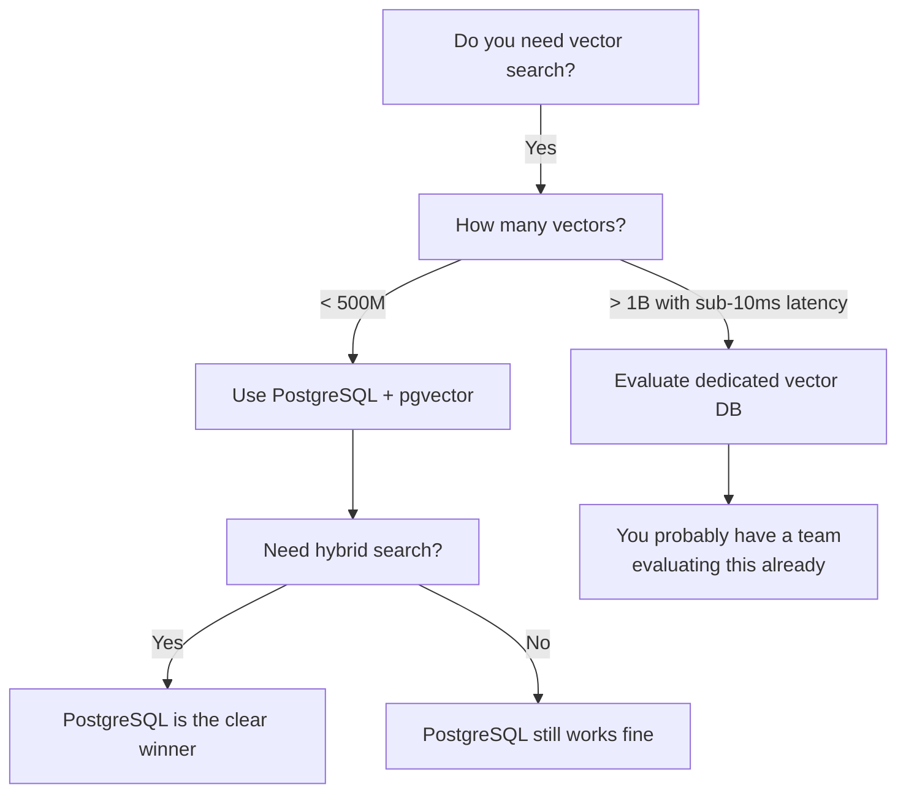

# Chapter 7: When to Use a Dedicated Vector Database

PostgreSQL with pgvector handles most AI workloads. Here is where it does not.

## The Problem

Every tool has limits. If you only hear "PostgreSQL does everything," you will hit a wall eventually and not understand why. Knowing the boundaries lets you make the right architectural decision from the start -- not after a painful migration.

## Core Concept

The decision comes down to two questions:

1. **What scale are you operating at?** Hundreds of millions of vectors in PostgreSQL is well-documented territory. Billions with sub-10ms latency at high query throughput is where dedicated systems earn their keep.
2. **What capabilities do you need?** If you need multimodal embeddings across different vector dimensions, or cutting-edge approximate nearest neighbor research, dedicated vector databases may have features pgvector does not yet support.

For most AI applications -- RAG systems, knowledge base search, AI assistants with document retrieval -- PostgreSQL is the right choice.

## How It Works

### When PostgreSQL is enough

PostgreSQL with pgvector handles these scenarios well:

- **RAG applications** with up to hundreds of millions of documents. HNSW indexes provide fast approximate nearest neighbor search with high recall.
- **Hybrid search** combining vector similarity with keyword matching and relational filters. This is PostgreSQL's strongest advantage -- running all three in a single query.
- **Applications that already use PostgreSQL.** Adding pgvector to your existing database eliminates an entire service, its sync problem, and its bill.
- **Early-stage products** where you are iterating on your retrieval strategy. Changing your search approach in SQL is faster than re-architecting across services.
- **Applications that need ACID transactions** across vector and relational data. When you delete a user, their embeddings should disappear in the same transaction.

### When a dedicated vector database wins

There are genuine cases where Pinecone, Weaviate, Qdrant, or Milvus are the better choice:

- **Billion-scale datasets with sub-10ms latency at high query throughput.** At this scale, systems purpose-built for vector search can optimize memory layout and sharding in ways a general-purpose database cannot match. If you are operating here, you probably already have a team evaluating this properly.
- **Multimodal embeddings with different vector dimensions.** If you need to search across text, image, and audio embeddings in a single index with different dimensionalities, some dedicated vector databases handle this more naturally.
- **Cutting-edge ANN research.** Dedicated systems sometimes adopt new indexing algorithms (like DiskANN or graph-based methods) before pgvector does. This gap is narrowing.

### The case that does NOT justify a dedicated vector database

Your product is early stage. You are iterating on your retrieval strategy. You do not want to manage another service. Your dataset is under 100 million vectors.

That is most of us. Start with PostgreSQL.

## Diagram

## A note on Supabase

Supabase provides hosted PostgreSQL with pgvector pre-installed. All the SQL in this tutorial works on Supabase without modification. If you want managed PostgreSQL with vector search and do not want to run your own infrastructure, Supabase is a direct path.

## Key Takeaways

- PostgreSQL with pgvector handles the majority of AI application workloads, including RAG, knowledge base search, and hybrid search.
- Dedicated vector databases earn their keep at billion-scale with extreme latency requirements. That threshold excludes most applications.
- The strongest case for PostgreSQL is hybrid search -- combining vector, full-text, and relational queries in a single system. Dedicated vector databases struggle to do this cleanly.
- If you already run PostgreSQL, adding pgvector eliminates an entire service and its sync problem.
- PostgreSQL has been in production for over 35 years. Your future self will thank you for the boring choice.
- Supabase gives you hosted PostgreSQL with pgvector if you want managed infrastructure.

## Learn More

- [pgvector performance benchmarks](https://github.com/pgvector/pgvector#performance)
- [Supabase Vector documentation](https://supabase.com/docs/guides/ai)
- [ANN Benchmarks (comparison of vector search methods)](https://ann-benchmarks.com/)
