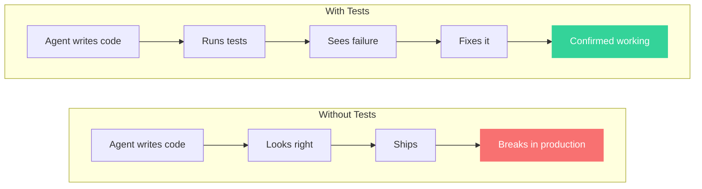
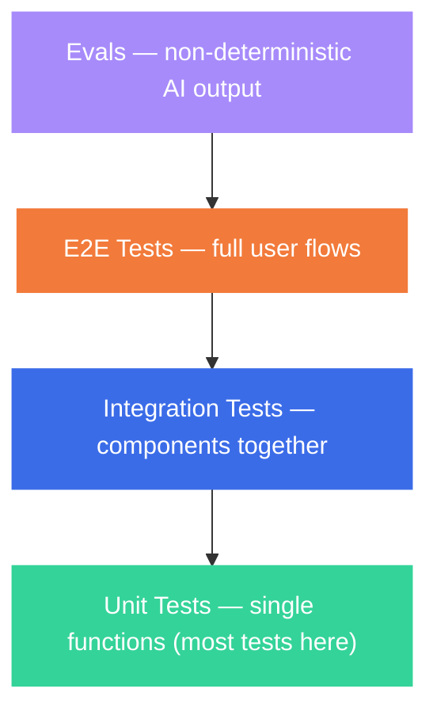
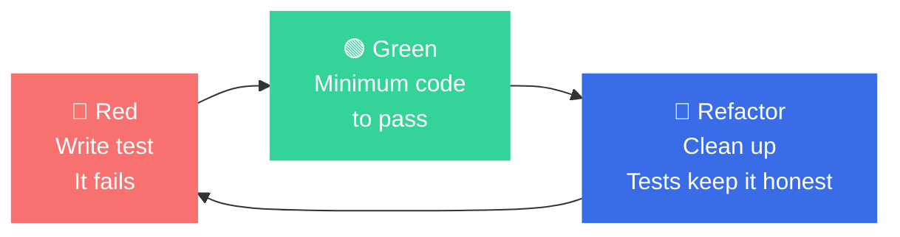
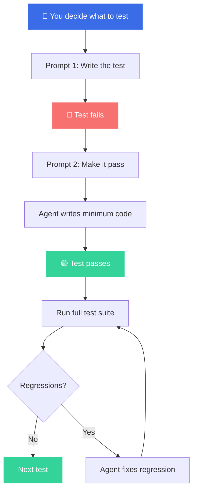

# How I Test AI-Generated Code

Companion repo for the video. Everything you need to set up a testing workflow with AI coding agents.

## The Problem

AI agents write code that looks correct, passes a quick glance, and then breaks in ways you don't expect. Without tests, the agent is relying on its own judgment about whether the code is correct. That judgment is sometimes wrong.

Tests give the agent a closed feedback loop. Write code, run the tests, see what failed, fix it. The agent can actually verify its own work.

## Why Testing Matters More With AI Agents

Two reasons we write tests:

1. **Correctness.** The code does what it's meant to do right now.
2. **Regressions.** Changes to one part of the codebase don't break something else.

AI agents make both worse. They make dozens of changes across your codebase in a single session. They're focused on the task in front of them and have no idea they just broke authentication in another file. Tests are your insurance.



## The Testing Pyramid



## What to Test

| Test This | Skip This |
|-----------|-----------|
| Business logic (scoring, pricing, access rules) | Framework boilerplate (does FastAPI return 200?) |
| Complex conditionals with multiple branches | Library behavior (does `json.loads` work?) |
| Data transformations (reshape input to output) | Mocks testing mocks |
| Edge cases AI consistently misses (nulls, boundaries) | Simple CRUD with no custom logic |

**The rule:** "Am I testing my logic or someone else's code?" If someone else's, skip it.

## Test-First vs Test-After

### Test-After (common approach)

Write code first, then write tests to verify. Better than no tests. But with AI agents, if you say "write tests for this code," the agent reads the code and writes tests that pass the current behavior. It's grading its own homework.

The stat: AI-generated code with 100% test coverage scored **4% on mutation testing**. Every line executed. Every test green. Caught almost nothing.

### Test-First (TDD)

Write the test first. The test describes what the code *should* do. Then write the code to make it pass.



With AI agents, this gives the agent a concrete target and prevents over-engineering.

## The Two-Prompt Approach

The key insight: separate **what to test** from **making it pass**.



### Prompt 1: Write the Test

You decide what needs a test. Be specific about the behavior, not the implementation.

```
Write a test for the candidate scoring logic.
Test the edge case where a candidate has zero years of experience
but perfect skill matches. The score should still be above 0.5
because skills matter more than tenure.

Only write the test. Do not implement anything.
Run the test with: uv run pytest tests/ -x
Confirm it fails.
```

### Prompt 2: Make It Pass

Now the agent has a failing test. Its only job is to write the implementation.

```
Run the failing tests. Implement the minimum code to make them pass.
Do not modify the tests. Do not add tests.
After all tests pass, run the full test suite to check for regressions.
```

### Why Two Prompts?

If you say "write tests and implement this feature," you've handed over the most important decision: **what to test**. The agent will test everything because it has no judgment about what matters in your system. You do.

Research backs this up: targeted TDD reduced regressions by 70%. Vague "do TDD" instructions made things worse (regressions went from 6% to 10%).

## Single-Prompt Alternative

For smaller tasks where the stakes are lower:

```
Implement the email validation endpoint.
Use red-green TDD. Only write tests for:
- Business logic and validation rules
- Edge cases (empty input, malformed emails, unicode)
Do NOT write tests for:
- Framework routing (FastAPI handles this)
- Database connection boilerplate
- Library functions

Run tests with: uv run pytest tests/ -x
```

## CLAUDE.md Testing Config

Drop this into your project's `CLAUDE.md` to set the testing baseline for every session:

```markdown
## Testing

- Run tests with: `uv run pytest tests/ -x`
- Use red-green TDD for new features with business logic
- Write tests for: business logic, complex conditionals, data transformations, edge cases
- Do NOT write tests for: framework boilerplate, library behavior, simple CRUD
- After implementation, run the full test suite to check for regressions
- If tests fail, fix the code, not the tests (unless the test is genuinely wrong)
```

## Example: Good Test vs Bad Test

### Good: Tests business logic

```python
def test_scorer_zero_experience_perfect_skills():
    """Candidate with no experience but perfect skill match
    should still score above 0.5 because skills outweigh tenure."""
    candidate = Candidate(years_experience=0, skills=["python", "fastapi", "postgresql"])
    job = Job(required_skills=["python", "fastapi", "postgresql"])

    score = calculate_score(candidate, job)

    assert score > 0.5
    assert score < 1.0  # Not a perfect score without experience
```

### Good: Tests a security boundary

```python
def test_recruiter_cannot_see_other_recruiters_candidates():
    """Data isolation: recruiter A should never see recruiter B's candidates."""
    recruiter_a = create_recruiter("alice@company.com")
    recruiter_b = create_recruiter("bob@company.com")
    candidate = create_candidate(recruiter_id=recruiter_b.id)

    response = client.get("/candidates", headers=auth_headers(recruiter_a))

    assert candidate.id not in [c["id"] for c in response.json()]
```

### Bad: Tests the framework

```python
def test_health_endpoint_returns_200():
    """This tests FastAPI, not your code."""
    response = client.get("/health")
    assert response.status_code == 200
```

### Bad: Tests a mock

```python
def test_sends_email(mock_smtp):
    """This tests that the mock was called, not that email actually works."""
    send_welcome_email("user@example.com")
    mock_smtp.send.assert_called_once()
    # When the real SMTP server rejects the email, this test still passes.
```

## The Live Demo Workflow

What I show in the video, step by step:

### Cycle 1: Auth

```
Prompt: "Write a test that verifies a user with the wrong password gets a 401."
-> Agent writes test -> Run -> Red (or Green if auth works, which locks in the behavior)
```

### Cycle 2: Scorer Edge Case

```
Prompt: "Write a test for when a candidate has zero experience but perfect skill matches."
-> Agent writes test -> Run -> Red
-> Agent implements -> Run -> Green
-> Run full suite -> No regressions
```

### Cycle 3: Data Isolation

```
Prompt: "Write a test that recruiter A cannot see recruiter B's candidates."
-> Agent writes test -> Run -> Red (no tenant filtering exists)
-> Agent adds scoping to query -> Run -> Green
```

### The Skip

"I'm not going to write a test for this CRUD endpoint. It's standard FastAPI. A test here would just be testing that FastAPI works."

## Key Stats

| Stat | Source |
|------|--------|
| AI-generated tests: 100% coverage, 4% mutation score | HumanEval-Java study |
| AI-authored PRs: 75% more logic errors than human PRs | CodeRabbit, Dec 2025 |
| Targeted TDD: 70% regression reduction | TDAD paper (arXiv) |
| Vague TDD instructions: regressions increased from 6% to 10% | TDAD paper (arXiv) |

## Files in This Repo

```
testing-ai-generated-code/
├── README.md              # This file
├── SLIDES.html            # Branded slide deck for the video
├── prompts/
│   ├── test-first.md      # Prompt 1: Write the test (with wrong vs right examples)
│   ├── make-it-pass.md    # Prompt 2: Make it pass
│   ├── single-prompt.md   # Combined approach for smaller tasks
│   └── claude-md.md       # CLAUDE.md testing config (Python, TS, Ruby)
└── examples/
    ├── COMPARISON.md       # Before vs after comparison table
    ├── good-tests.py       # Examples of useful tests
    ├── bad-tests.py        # Examples of wasteful tests
    ├── trivial-tests/      # Before: implementation-focused prompt
    │   ├── auth_service.py     # The implementation
    │   └── test_auth_service.py # 7 tests, mostly testing libraries
    └── better-tests/       # After: risk-focused prompt
        ├── auth_service.py     # The improved implementation
        └── test_auth_service.py # 6 tests, all proving real requirements
```

## Related

- [How I Review AI-Generated Code](../ai-code-review/) - The companion video on code review
- [Blueprint plugin](https://github.com/owainlewis/blueprint) - Full SDLC workflow including TDD skill
